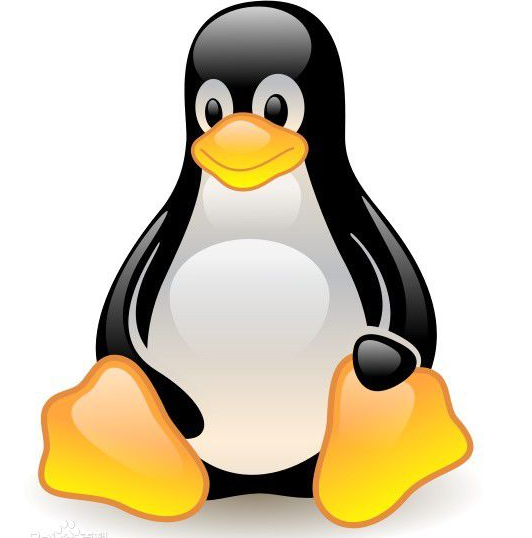

# Linux 简介

---

## Linux 发展史

要说清楚Linux的历史，首先得说说Unix。

Unix操作系统的历史漫长而曲折，它的第一个版本是1969年由Ken Thompson在AT&T贝尔实验室实现的，运行在一台DEC PDP-7计算机上。这个系统非常粗糙，与现代Unix相差很远，它只具有操作系统最基本的一些特性。后来Ken Thompson和Dennis Ritchie使用C语言对整个系统进行了再加工和编写，使得Unix能够很容易的移植到其他硬件的计算机上。从那以后，Unix系统开始了令人瞩目的发展。

Linux就是一个类Unix。

1991年8月一 位来自芬兰赫尔辛基大学的年轻人Linus Benedict Torvalds，对外发布了一套全新的操作系统。事情的缘起是这样的：为了实习使用著名的计算机科学家 Andrew S.Tanenbaum开发的 Minix （一套功能简单，简单易懂的UNIX操作系统，可以在8086上运行，后来也支持80386， 在一些PC机平台上非常流行），Linus购买了一台386微机，但是他发现Minix的功能还 很不完善，于是他决心自己写一个保护模式下的操作系统，这就是Linux的原型。最开始的 Linux是用汇编语言编写的。主要工作是用来处理80386保护模式。

1991年10月5日，Linus发布了Linux的第一个“正式”版本： 0.02版，现在Linusx可以运行bash（GNU的一个UNIX shell程序），GCC（GNU的C编译器），它几乎还 是什么事情都做不了，但是它被设计成一个黑客的操作系统，主要的注意力被集中在系统 核心的开发工作上了，没有人去注意用户支持，文档工作，版本发布等等其他东西。 

最开始的Linux版本被放置到一个FTP服务器上供大家自由下载，FTP服务器的管理 员认为这是Linus的Minix，因而就建了一个Linux目录来存放这些文件，于是Linux这个 名字就传开了，如今已经成了约定俗成的名称了。 目前Linux已经是一个完整的类UNIX操作系统了。下面就是Linux的吉祥物，一只可爱的小企鹅Tux（起因是因为Linus是芬兰人，因而挑 选企鹅作为吉祥物）：

Linux是一个免费的操作系统，用户可以免费获得其源代码，并能够随意修改。它是在共用许可证GPL(General Public License)保护下的自由软件，也有好几种版本，如Red Hat Linux、Slackware，以及国内的Xteam Linux等。 

Linux具有许多Unix系统的功能和特点，能够兼容Unix，但无需支付Unix高额的费用。比如一个Unix程序员在单位可以在Unix系统上进行工作，回到家里在Linux系统上也能完成同样的工作，而不必重新购买Unix。要知道Unix的价格比常见的Windows要高出若干倍，和Linux的低廉更是相距甚远。 

Linux的应用也十分广泛。Sony最新的PS2游戏机就采用了Linux作为系统软件，使PS2摇身一变，成为了一台Linux工作站。著名的电影《泰坦尼克号》的数字技术合成工作就是利用100多台Linux服务器来完成的。 

2001年8月17日，Linux发布了最新的Linux 2.4.9版，它也已经十岁了。 

**Linux的优点**

Linux的流行是因为它具有许多诱人之处。 

- 完全免费 

Linux是一款免费的操作系统，用户可以通过网络或其他途径免费获得，并可以任意修改其源代码。这是其他的操作系统所做不到的。正是由于这一点，来自全世界的无数程序员参与了Linux的修改、编写工作，程序员可以根据自己的兴趣和灵感对其进行改变。这让Linux吸收了无数程序员的精华，不断壮大。 

- 完全兼容POSIX 1.0标准 

这使得可以在Linux下通过相应的模拟器运行常见的DOS、Windows的程序。这为用户从Windows转到Linux奠定了基础。许多用户在考虑使用Linux时，就想到以前在Windows下常见的程序是否能正常运行，这一点就消除了他们的疑虑。 

- 多用户、多任务 

Linux支持多用户，各个用户对于自己的文件设备有自己特殊的权利，保证了各用户之间互不影响。多任务则是现在电脑最主要的一个特点，Linux可以使多个程序同时并独立地运行。 

- 良好的界面 

Linux同时具有字符界面和图形界面。在字符界面用户可以通过键盘输入相应的指令来进行操作。它同时也提供了类似Windows图形界面的X-Windows系统，用户可以使用鼠标对其进行操作。在X-Windows环境中就和在Windows中相似，可以说是一个Linux版的Windows。 

- 丰富的网络功能 

互联网是在Unix的基础上繁荣起来的，Linux的网络功能当然不会逊色。它的网络功能和其内核紧密相连，在这方面Linux要优于其他操作系统。在Linux中，用户可以轻松实现网页浏览、文件传输、远程登陆等网络工作。并且可以作为服务器提供WWW、FTP、E-Mail等服务。 

- 可靠的安全、稳定性能 

Linux采取了许多安全技术措施，其中有对读、写进行权限控制、审计跟踪、核心授权等技术，这些都为安全提供了保障。Linux由于需要应用到网络服务器，这对稳定性也有比较高的要求，实际上Linux在这方面也十分出色。 

- 支持多种平台 

Linux可以运行在多种硬件平台上，如具有x86、680x0、SPARC、Alpha等处理器的平台。此外Linux还是一种嵌入式操作系统，可以运行在掌上电脑、机顶盒或游戏机上。2001年1月份发布的Linux 2.4版内核已经能够完全支持Intel 64位芯片架构。同时Linux也支持多处理器技术。多个处理器同时工作，使系统性能大大提高。 

**Linux的不足**

由于在现在的个人电脑操作系统行业中，微软的Windows系统仍然占有大部分的份额，绝大多数的软件公司都支持Windows。这使得Windows上的应用软件应有尽有，而其他的操作系统就要少一些。许多用户在换操作系统的时候都会考虑以前的软件能否继续使用，换了操作系统后是否会不方便。虽然Linux具有DOS、Windows模拟器，可以运行一些Windows程序，但Windows系统极其复杂，模拟器所模拟的运行环境不可能完全与真实的Windows环境一模一样，这就使得一些软件无法正常运行。 

许多硬件设备面对Linux的驱动程序也不足，不少硬件厂商是在推出Windows版本的驱动程序后才编写Linux版的。但一些大硬件厂商在这方面做得还不错，他们的Linux版驱动程序一般都推出得比较及时。 

软件支持的不足是Linux最大的缺憾，但随着Linux的发展，越来越多的软件厂商会支持Linux，它应用的范围也越来越广。这只小企鹅的前景是十分光明的。

## 为什么服务器要选择Linux

- **开源**

Linux Server 相较 Windows Server 领先的首要原因是完全免费且可用作开源用途。通过开源方式，您可以轻松查看用于创建 Linux 内核的代码，也可以对代码进行修改和再创作。通过许多编程接口，您甚至可以开发自己的程序并将其添加到 Linux 操作系统中。还可以对 Linux Server 操作系统进行自定义，以满足使用要求，这是 Windows 无法实现的。

- **稳定性**

Linux 系统一直以其稳定性而闻名，它们可以连续运行多年而不发生任何重大问题。事实上，很多 Linux 用户都从未在自己的环境中遇到过系统崩溃的情况。相对 Windows 而言，挂起和崩溃完全是一种常态。

尽管 Windows 也可以很好地执行多任务处理，但 Linux 可以在处理各种任务的同时，仍能提供坚如磐石的性能。

当将 Linux 与 Windows 进行对比时，对每项系统配置的更改都需要重启 Windows Server，而 Linux 更改大多数配置时都无需重启服务器即可生效，这也确保了 Linux 服务器最短的停机时间。

- **安全**

Linux 由最初的多用户操作系统开发的 UNIX 操作系统发展而来，在安全方面显然比 Windows 更强。与 Windows 作为病毒和恶意软件攻击的首要目标不同，Linux Server 只有管理员或特定用户才有权访问 Linux 内核，而且 Linux 服务器(相较 Windows 而言)不会经常受到攻击，并且被发现的任何漏洞都会在第一时间由大批 Linux 开发人员修复。

- **硬件**

当将 Linux Server 与 Windows Server 在硬件方面进行比较时，Windows 需要经常对硬件进行升级以满足各方面性能需求。而 Linux 对硬件的需求则很低，也不需要频繁对硬件进行升级更新，并且无论系统架构或处理器如何，都能表现得非常出色。

- **灵活性**

Linux 是世界上最灵活的操作系统，没有之一，您可以根据需要自定义系统。使用 Linux，您可以随心所欲地安装 GUI 界面或仅使用「终端」管理服务器;使用 Linux，您可以选择各种工具和实用程序来管理所有与服务器相关的活动，如：添加用户、管理服务和网络，安装新应用程序以及监控性能等。

而 Shell 是 Linux 系统中最强大的组件，允许您运行各种程序并允许与内核进行交互。 总的来说，Linux 为您提供了对服务器的完全控制、掌控权利。

- **总体拥有成本(TCO)和维护**

在总体拥有成本方面，由于 Linux 在使用上属于完全免费。即便您购买了针对企业或组织的 Linux 发行版，也会比 Windows 或其他许可软件花费更少。

- **自由**

对 Linux 而言，您不会被商业供应商强加产品和服务，用户可以自由选择适合需求的产品。正是这种自由使得像 Amazon 和 Google 这样的大公司选择了基于 Linux 的服务器来提供服务。

- **访问开源应用程序**

Linux 为开源应用程序开辟了一个新的世界，有数以千计的开源应用程序正在等待用户探索，您甚至可以使用特殊界面在 Linux 服务器上运行 Windows 应用程序。

- **易于变更**

与 Windows Servers 不同，您可以轻松对 Linux Server 进行变更，并且无需重启服务器。对于 Windows Server 而言，要使用微软发布的新功能就得购买下一个版本。

- **社区支持**

Linux 社区在全球都十分活跃和使用广泛，总有数千名志愿者在线活动以解决其他Linux 用户的问题，所以几乎在任何 Linux 论坛上发布的任何问题都会得到即时响应。而选择使用 Linux Enterprise 版本时，还会附有付费支持选项。

## 系统目录结构
