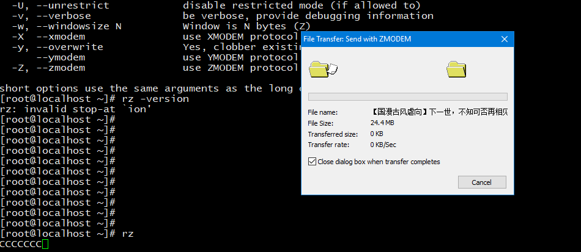

# 简述

通常，利用SSH管理远程Linux服务器时，经常需要与本地交互文件。当然，我们可以利用 `FTP`方式，比如通过 `Filezilla` 客户端软件。不过直接使用 `SSH` 软件（`SecureCRT`、`Xshell`）自带的上传和下载功能无疑使最方便快捷的。通常SSH软件支持的文件传输协议主要有 `ASCII`、`Xmodem`、`Zmodem` 等。

`rz`、`sz` 是便是 `Linux/Unix` 同 `Windows` 进行 `ZModem` 文件传输的命令行工具，使用该命令前提需要安装 `lszrz` 包。

# 文本传输协议

文件传输是数据交换的主要形式。在进行文件传输时，为使文件能被正确识别和传送，我们需要在两台计算机之间建立统一的传输协议。这个协议包括了文件的识别、传送的起止时间、错误的判断与纠正等内容。常见的传输协议有以下几种：

* `ASCII`：这是最快的传输协议，但只能传送文本文件。 

* `Xmodem`：这种古老的传输协议速度较慢，但由于使用了 `CRC` 错误侦测方法，传输的准确率可高达99.6%。 

* `Ymodem`：这是 `Xmodem` 的改良版，使用了1024位区段传送，速度比 `Xmodem` 要快

* `Zmodem`：`Zmodem` 采用了串流式（`streaming`）传输方式，传输速度较快，而且还具有自动改变区段大小和断点续传、快速错误侦测等功能。这是目前最流行的文件传输协议。

# 安装 lszrz

单单是SSH客户端软件支持以上文件传输协议（`ASCIIXmodem`、`Ymodem`、`Zmodem·）还不行，我们的Linux服务器上也得安装相应的软件，以支持这些文件传输协议才行。在Linux上，`lrzsz` 就是完成此任务的，`lrzsz` 就是一个支持 `Zmodem` 传输协议的工具。我们通过 `sz/rz` 两个命令，分别发送/接收文件。如果我们的系统中没有安装 `lrzsz` 这个包，就会报错，安装即可解决。

```
$ rz
-bash: rz: command not found
$ yum -y install lrzsz
```

当然，在安装之前也可以使用 `yum search <package>` 命令进行查找 `lrzsz`：

```
$ yum search lrzsz
已加载插件：fastestmirror
Loading mirror speeds from cached hostfile
 * base: mirrors.aliyun.com
 * extras: mirrors.aliyun.com
 * updates: mirrors.aliyun.com
================================================================ N/S matched: lrzsz ================================================================
lrzsz.x86_64 : The lrz and lsz modem communications programs
```

安装日志如下所示：

```
$ yum -y install lrzsz
已加载插件：fastestmirror
Loading mirror speeds from cached hostfile
 * base: mirrors.aliyun.com
 * extras: mirrors.aliyun.com
 * updates: mirrors.aliyun.com
base                                                                                                                         | 3.6 kB  00:00:00     
extras                                                                                                                       | 3.4 kB  00:00:00     
updates                                                                                                                      | 3.4 kB  00:00:00     
(1/4): base/7/x86_64/primary_db                                                                                              | 6.0 MB  00:00:01     
(2/4): extras/7/x86_64/primary_db                                                                                            | 153 kB  00:00:01     
(3/4): updates/7/x86_64/primary_db                                                                                           | 1.3 MB  00:00:02     
(4/4): base/7/x86_64/group_gz                                                                                                | 166 kB  00:00:02     
正在解决依赖关系
--> 正在检查事务
---> 软件包 lrzsz.x86_64.0.0.12.20-36.el7 将被 安装
--> 解决依赖关系完成

依赖关系解决

====================================================================================================================================================
 Package                          架构                              版本                                      源                               大小
====================================================================================================================================================
正在安装:
 lrzsz                            x86_64                            0.12.20-36.el7                            base                             78 k

事务概要
====================================================================================================================================================
安装  1 软件包

总下载量：78 k
安装大小：181 k
Downloading packages:
lrzsz-0.12.20-36.el7.x86_64.rpm                                                                                              |  78 kB  00:00:00     
Running transaction check
Running transaction test
Transaction test succeeded
Running transaction
  正在安装    : lrzsz-0.12.20-36.el7.x86_64                                                                                                     1/1 
  验证中      : lrzsz-0.12.20-36.el7.x86_64                                                                                                     1/1 

已安装:
  lrzsz.x86_64 0:0.12.20-36.el7                                                                                                                     

完毕！
```

# rz 基本用法

`rz` 中的 `r` 意为 `received`（接收），告诉客户端，我（服务器）要接收文件 `received by cilent`，就等同于客户端在上传。

```
$ rz --help
rz version 0.12.20
Usage: rz [options] [filename.if.xmodem]
Receive files with ZMODEM/YMODEM/XMODEM protocol
    (X) = option applies to XMODEM only
    (Y) = option applies to YMODEM only
    (Z) = option applies to ZMODEM only
  -+, --append                append to existing files
  -a, --ascii                 ASCII transfer (change CR/LF to LF)
  -b, --binary                binary transfer
  -B, --bufsize N             buffer N bytes (N==auto: buffer whole file)
  -c, --with-crc              Use 16 bit CRC (X)
  -C, --allow-remote-commands allow execution of remote commands (Z)
  -D, --null                  write all received data to /dev/null
      --delay-startup N       sleep N seconds before doing anything
  -e, --escape                Escape control characters (Z)
  -E, --rename                rename any files already existing
      --errors N              generate CRC error every N bytes (debugging)
  -h, --help                  Help, print this usage message
  -m, --min-bps N             stop transmission if BPS below N
  -M, --min-bps-time N          for at least N seconds (default: 120)
  -O, --disable-timeouts      disable timeout code, wait forever for data
      --o-sync                open output file(s) in synchronous write mode
  -p, --protect               protect existing files
  -q, --quiet                 quiet, no progress reports
  -r, --resume                try to resume interrupted file transfer (Z)
  -R, --restricted            restricted, more secure mode
  -s, --stop-at {HH:MM|+N}    stop transmission at HH:MM or in N seconds
  -S, --timesync              request remote time (twice: set local time)
      --syslog[=off]          turn syslog on or off, if possible
  -t, --timeout N             set timeout to N tenths of a second
  -u, --keep-uppercase        keep upper case filenames
  -U, --unrestrict            disable restricted mode (if allowed to)
  -v, --verbose               be verbose, provide debugging information
  -w, --windowsize N          Window is N bytes (Z)
  -X  --xmodem                use XMODEM protocol
  -y, --overwrite             Yes, clobber existing file if any
      --ymodem                use YMODEM protocol
  -Z, --zmodem                use ZMODEM protocol

short options use the same arguments as the long ones
```

想要接收文件直接输入命令 `rz` 即可：

```
$ rz
```




# sz 基本用法

`sz` 中的 `s` 意为 `send`（发送），告诉客户端，我（服务器）要发送文件 `send to cilent`，就等同于客户端在下载。

```
$ sz --help
sz version 0.12.20
Usage: sz [options] file ...
   or: sz [options] -{c|i} COMMAND
Send file(s) with ZMODEM/YMODEM/XMODEM protocol
    (X) = option applies to XMODEM only
    (Y) = option applies to YMODEM only
    (Z) = option applies to ZMODEM only
  -+, --append                append to existing destination file (Z)
  -2, --twostop               use 2 stop bits
  -4, --try-4k                go up to 4K blocksize
      --start-4k              start with 4K blocksize (doesn't try 8)
  -8, --try-8k                go up to 8K blocksize
      --start-8k              start with 8K blocksize
  -a, --ascii                 ASCII transfer (change CR/LF to LF)
  -b, --binary                binary transfer
  -B, --bufsize N             buffer N bytes (N==auto: buffer whole file)
  -c, --command COMMAND       execute remote command COMMAND (Z)
  -C, --command-tries N       try N times to execute a command (Z)
  -d, --dot-to-slash          change '.' to '/' in pathnames (Y/Z)
      --delay-startup N       sleep N seconds before doing anything
  -e, --escape                escape all control characters (Z)
  -E, --rename                force receiver to rename files it already has
  -f, --full-path             send full pathname (Y/Z)
  -i, --immediate-command CMD send remote CMD, return immediately (Z)
  -h, --help                  print this usage message
  -k, --1k                    send 1024 byte packets (X)
  -L, --packetlen N           limit subpacket length to N bytes (Z)
  -l, --framelen N            limit frame length to N bytes (l>=L) (Z)
  -m, --min-bps N             stop transmission if BPS below N
  -M, --min-bps-time N          for at least N seconds (default: 120)
  -n, --newer                 send file if source newer (Z)
  -N, --newer-or-longer       send file if source newer or longer (Z)
  -o, --16-bit-crc            use 16 bit CRC instead of 32 bit CRC (Z)
  -O, --disable-timeouts      disable timeout code, wait forever
  -p, --protect               protect existing destination file (Z)
  -r, --resume                resume interrupted file transfer (Z)
  -R, --restricted            restricted, more secure mode
  -q, --quiet                 quiet (no progress reports)
  -s, --stop-at {HH:MM|+N}    stop transmission at HH:MM or in N seconds
      --tcp                   build a TCP connection to transmit files
      --tcp-server            open socket, wait for connection
  -u, --unlink                unlink file after transmission
  -U, --unrestrict            turn off restricted mode (if allowed to)
  -v, --verbose               be verbose, provide debugging information
  -w, --windowsize N          Window is N bytes (Z)
  -X, --xmodem                use XMODEM protocol
  -y, --overwrite             overwrite existing files
  -Y, --overwrite-or-skip     overwrite existing files, else skip
      --ymodem                use YMODEM protocol
  -Z, --zmodem                use ZMODEM protocol

short options use the same arguments as the long ones
```

**下载一个文件**

```
$ sz fileName
```

**下载多个文件**

```
$ sz fileName1 fileName2
```

**下载 dir 目录下所有文件，不包含 dir 下的文件夹**

```
$ sz dir/*
```

# 总结

记住一点，不论是 `send` 还是 `received`，动作都是在服务器上发起的。我们习惯了说上传或是下载，其实大可不必。使用这两个命令，只要思考一点，是要把文件从服务器上发送出去，还是从客户端接收回来，就可以了。

最后总结为一句话：

**我（客户端）上传，你（服务器）接收（RZ），我下载（客户端），你（服务器）发送（SZ）。**