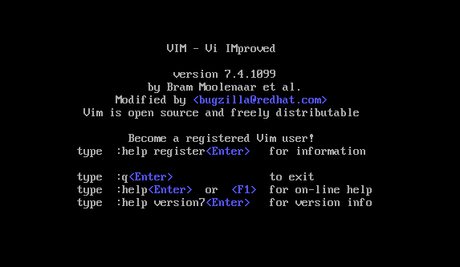

# vim 安装与使用

---

`vim` 与 `vi` 都是Linux下多模式编辑器，不同的是 `vim` 是 `vi` 的省级版本。它不仅兼容 `vi` 的所有指令，而且还有一些新的特性。

`vim` 比较 `vi` 的主要优势在于：

- **多级撤销：** 在 `vi` 中按 `u` 只能撤销上次命令，而 `vim` 可以无限制的撤销。
- **语法高亮**
- **易用性：** `vi` 只能在 unix 中，而 `vim` 可以运行在 `unix`、`mac`、`windows`等平台。
- ...

虽然 `vim` 想比较 `vi` 更有有优势，不过 `Centos` 下是默认不安装该命令。

输入命令：

```
[root@localhost ~]# vim
-bash: vim: command not found 
```

因此，在使用该命令之前我们需要先安装该命令。

## vim 安装

使用 `vim` 命令我们需要如下安装包：

```
vim-enhanced-${version}
vim-minimal-${version}
vim-common-${version}
```

输入命令：

```
npm -qa | grep vim
```

查看是否存在以上安装包：

```
[root@localhost ~]# rpm -qa|grep vim
vim-minimal-7.4.629-5.el6.x86_64
```

可以看到，只有一个 `vim-minimal` 安装包。因此需要安装另外两个安装包：

```
yum -y install vim-enhanced
```

以上安装包安装完成后输入命令 

```
vim
```

即进入并显示如下信息：

<div align=center>
