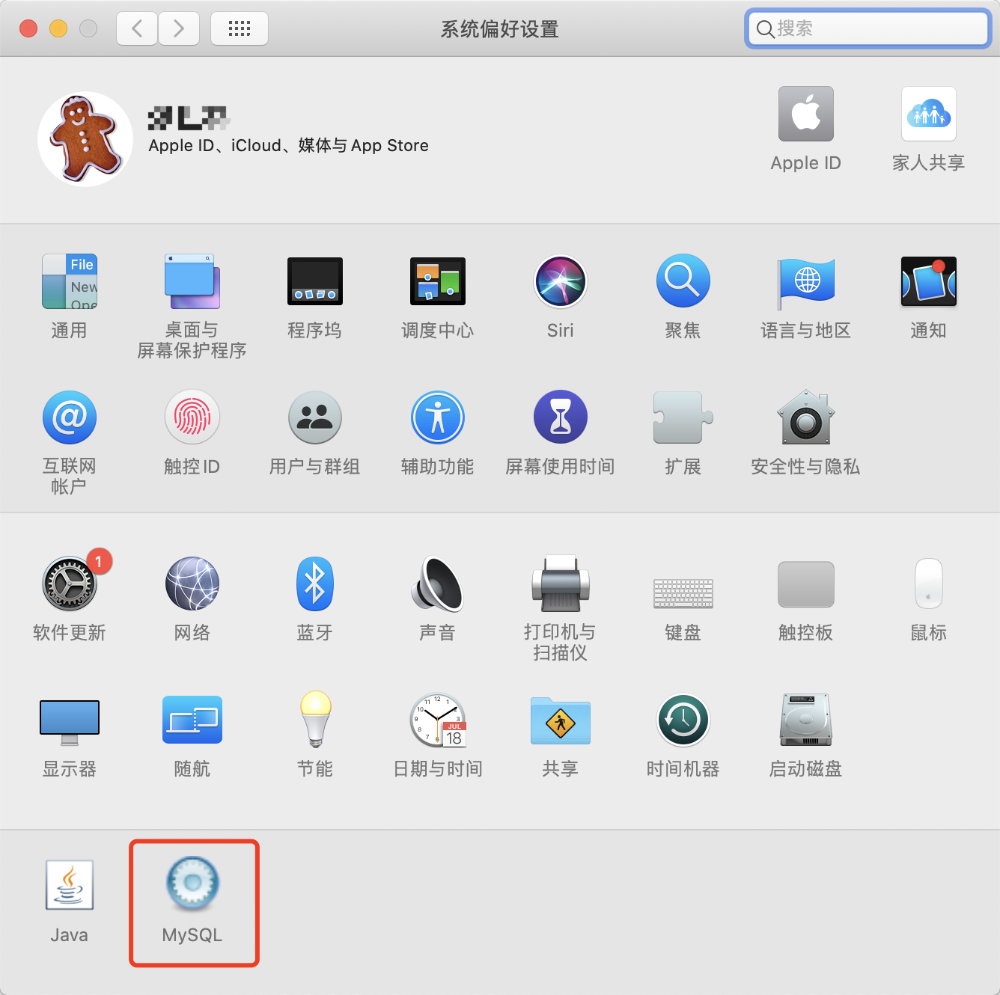
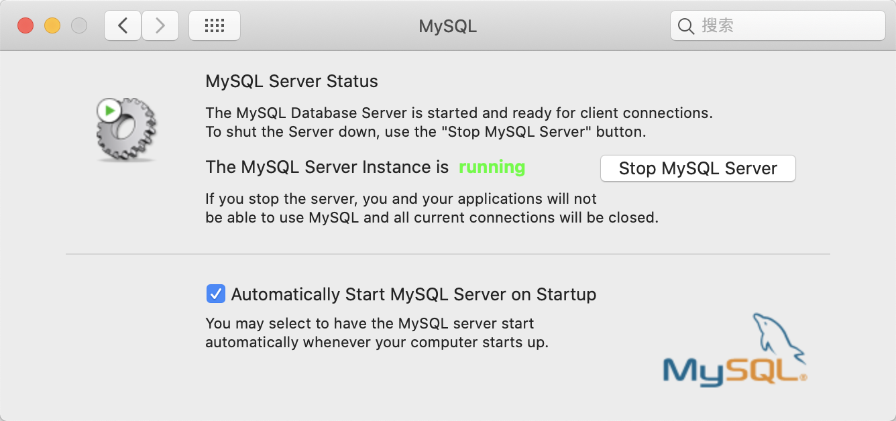

# 前言

Mac 与 Linux 有都是类似 unix 系统，所以系统结构与软件安装上都类似，这里直接以 Mac 说明。

另外，`utf8mb4` 的最低 MySQL 版本支持版本为 `5.5.3+`，若不是，请升级到较新版本。

# 杀死 MySQL 进程

先使用 `ps` 命令查看 MySQL 是否已启动：

```bash
$ ps -ef | grep mysqld
```

如果能查到进程需要先 `kill` 掉，一般 MySQL 安装目录为：`/usr/local/mysql`（具体根据实际安装查看目录），在该目录下如下文件：

```bash
$ ls /usr/local/mysql
COPYING		bin		docs		keyring		man		support-files
README		data		include		lib		share
```

其中 `support-files` 目录就是 MySQL 启动与运行的相关脚本（下面是当前机器上的文件脚本）：

```bash
$ ls /usr/local/mysql/support-files/
magic			mysql-log-rotate	mysql.server		mysqld_multi.server
```

`mysql.server` 就是 MySQL 启动相关的脚本：

```bash
# 杀死 MySQL 程序
$ sudo ./mysql.server stop

# 启动 MySQL 程序
$ sudo ./mysql.server start

# 重启 MySQL 程序
$ sudo ./mysql.server restart
```

直接运行上诉命令即可，另外使用 `ps` 工具查出 MySQL 进程后也可以使用 `kill -9/-15 PID` 进行终止 MySQL 程序（建议使用 `mysql.server` 程序）。

另外，如果是 Mac，可以直接在 `系统偏好设置` 中进行杀死/启动 MySQL 进程：




# 创建与查看启动配置

通常，MySQL 的启动脚本为 `my.cnf` 但是根据各版本不同所以我们首选需要查看具体使用什么文件，以及应该放置在哪个目录。进入 MySQL 的安装 `/bin` 目录（如果已经配置环境变量则不需要），在该目录下有个 `mysql` 程序。

在命令终端输入 `--help` 查看说明：

```bash
$ mysql --help
```

在输出的信息中，你会看到其中有如下信息：

```log
Default options are read from the following files in the given order:
/etc/my.cnf /etc/mysql/my.cnf /usr/local/mysql/etc/my.cnf /usr/local/mysql/my.cnf ~/.my.cnf
```

这段信息就是告诉你，MySQL 的启动配置文件名为 `my.cnf`，以及按优先级顺序放置的目录。所以，笔者就直接放在 `/etc` 目录下（如果该目录下没有 `my.cnf` 文件需要自行创建，另外通常在 `support-files` 目录下会有一个 `my-default.cnf` 文件，如果有直接拷贝并重名米为 `my.cnf` 放置在 `/ect` 目录下即可），因为笔者这里没有一个名为 `my-default.cnf` 的文件所以自行创建：

```bash
$ cd /etc

# 创建/编辑 my.cnf 文件
$ sudo vim my.cnf
```

> **注意：** 一定要使用 `sudo` 命令，否则对 `my.cnf` 文件只有只读权限，编辑后将无法保存！

最后，在 `my.cnf` 增加/修改成如下（仅仅对编码而言，如果已经配置了其他选项不要修改）

```conf
[client]

port=3306

# password=

# 客户端编码
default-character-set=utf8mb4

[mysql]

default-character-set=utf8mb4

[mysqld]

character-set-server = utf8mb4
init_connect = "SET NAMES utf8mb4"
collation-server = utf8mb4_unicode_ci
character-set-client-handshake = false

datadir=/usr/local/mysql/data/
```

**注意：** 在上面的信息中除了编码其他都是非必须项，比如 `datadir` 配置，因为笔者当前的 MySQL 存储目录为 `/usr/local/mysql/data/`（该目录也是 MySQL 默认目录）所以进行明确指定，如果不指定 MySQL 将会采用默认目录，这里做下说明！

编辑好之后按 `ESC` 后 `:wq` 保存即可！

最后，重启 MySQL 服务：

```bash
$ sudo ./mysql start
```

重启完成后，登录客户端：

```bash
$ mysql -u root -p
Enter password: 
```

最后，在输入如下查询 SQL 语句查看编码信息：

```msql
mysql> SHOW VARIABLES WHERE Variable_name LIKE 'character_set_%' OR Variable_name LIKE 'collation%';  

+--------------------------+-----------------------------------------------------------+
| Variable_name            | Value                                                     |
+--------------------------+-----------------------------------------------------------+
| character_set_client     | utf8mb4                                                   |
| character_set_connection | utf8mb4                                                   |
| character_set_database   | utf8mb4                                                   |
| character_set_filesystem | binary                                                    |
| character_set_results    | utf8mb4                                                   |
| character_set_server     | utf8mb4                                                   |
| character_set_system     | utf8                                                      |
| character_sets_dir       | /usr/local/mysql-5.7.25-macos10.14-x86_64/share/charsets/ |
| collation_connection     | utf8mb4_unicode_ci                                        |
| collation_database       | utf8mb4_unicode_ci                                        |
| collation_server         | utf8mb4_unicode_ci                                        |
+--------------------------+-----------------------------------------------------------+
```

`collation_connection`、`collation_database`、`collation_server` 是什么没关系。

但必须保证如下几个变量必须是 `utf8mb4`：

|系统变量					    |描述			   			|
|:--------------------------|:--------------------------|
|`character_set_client`	    |客户端来源数据使用的字符集	    |
|`character_set_connection` |连接层字符集				|
|`character_set_database`	|当前选中数据库的默认字符集	    |
|`character_set_results`	|查询结果字符集			    |
|`character_set_server`	    |默认的内部操作字符集		    |


# 数据库连接的配置

数据库连接参数中：

`characterEncoding=utf8` 会被自动识别为 `utf8mb4`，也可以不加这个参数，会自动检测。 而 `autoReconnect=true` 是必须加上的。

# 将数据库和已经建好的表也转换成 `utf8mb4`

更改数据库编码：

```mysql
ALTER DATABASE <DATABASE_NAME> CHARACTER SET utf8mb4 COLLATE utf8mb4_general_ci;
```

更改表编码：

```mysql
ALTER TABLE <TABLE_NAME> CONVERT TO CHARACTER SET utf8mb4 COLLATEutf8mb4_general_ci; 
```

如有必要，还可以更改列的编码