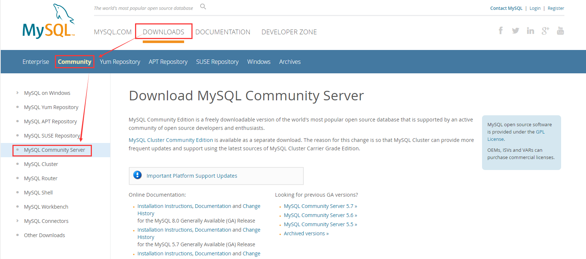
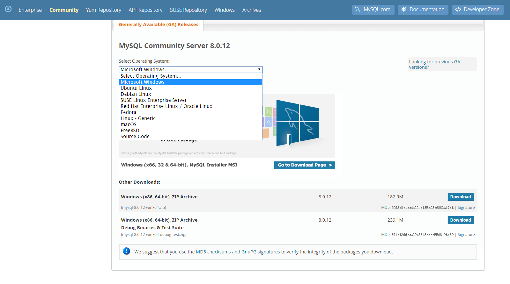
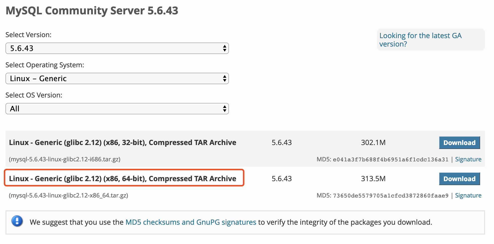

# 前言

Linux 安装 MySQL 有两种方式：

- **源码安装**，优点是安装包小,也就 20M，缺点是安装时需要的依赖比较多，而且还容易出错。
- **二进制文件安装**，优点是安装快，步骤少，缺点是安装包大，差不多了 500M。

二进制文件安装也是笔者推荐的安装方式，这里就介绍二进制文件安装方式。

# Mysql 下载

Mysql 二进制安装包可以到 [官网](https://www.mysql.com/) 进行下载。

在官网页面点击 `Downloads` - `Community` - `MySQL Community Server` 进入版本选择页面进行下载，如下图：



Linux 版本选择的操作系统是 `Linux - Generic`，如图：



另外，如果你不想下载最新版本你也可以点击 `Looking for previous GA versions?` 进行下载历史版本：


笔者这里选择的是 `v5.6.43`，因为最新的 MySQL `v8.0+` 与之前的加密算法做了改变，另外，目前很多工具对最新版本的支持度还不够友好，因此这里选择的是旧版本。

需要注意，下载 `MySQL` 之前需要确定操作系统位数，可以使用 `uname -sr` 命令进行查看：

```
$ uname -sr
Linux 3.10.0-957.5.1.el7.x86_64
```

所以，笔者的操作系统是 64 位，因此下载对应的版本：



# 安装 libaio 依赖包

在安装之前先安装 `libaio` 依赖包，有时 `centos` 系统自带的有这个依赖包所以不需要安装。

先检查是否已经安装 `libaio`：

```
$ rpm -qa | grep libaio
libaio-0.3.109-13.el7.x86_64
```

如果没有需要进行安装：

```
# 查询是否暗转 libaio 依赖包
$ yum search libaio

# 如果没安装，可以用下面命令安装
$ yum install -y libaio
```

# 安装与启动

将下载完成后的 MySQL 二进制安装文件上传至 Linux 的任意文件夹，笔者上传到了 `/home/tools` 目录下：

```
$ pwd
/home/tools

$ ls
mysql-5.6.43-linux-glibc2.12-x86_64.tar.gz
```

将二进制文件进行解压：

```
$ tar -xzvf mysql-5.6.43-linux-glibc2.12-x86_64.tar.gz

mysql-5.6.43-linux-glibc2.12-x86_64/lib/libmysqlclient_r.a
mysql-5.6.43-linux-glibc2.12-x86_64/lib/libmysqlclient_r.so.18
mysql-5.6.43-linux-glibc2.12-x86_64/lib/libmysqlclient.so

....

# 解压后看下当前文件夹是否多了一个 mysql 解压后的文件夹

$ ls
mysql-5.6.43-linux-glibc2.12-x86_64.tar.gz          mysql-5.6.43-linux-glibc2.12-x86_64
```

将解压后的文件夹复制到 `/usr/local` 目录下的并重命名为 mysql，先看下 `/usr/local` 文件夹下的内容：

```
$ ls /usr/local
bin  etc  games  include  lib  lib64  libexec  sbin  share  src
```

如果你列出的内容与我的有些差别，小细节，不必在意！

现在再使用 `cp` 命令进行复制：

```
$ cp mysql-5.6.43-linux-glibc2.12-x86_64 /usr/local/mysql -r
```

**注意：** 因为 `mysql-5.6.43-linux-glibc2.12-x86_64` 包含多级目录，因此需要在后面增加 `-r` 选项，目的是递归复制目录及其子目录内的所有内容。
另外，重命名的 `mysql` 目录后不要再加 `/`，即不要写成 `/usr/local/mysql/`。

执行成功后就能在 `/usr/local` 目录下看到 `mysql` 文件夹：

```
$ pwd
/usr/local

$ ls
bin  etc  games  include  lib  lib64  libexec  mysql  sbin  share  src
```

现在就来创建 `MySQL` 用户和用户组：

```
# 创建组
$ groupadd mysql

# 创建用户
$ useradd -r -g mysql mysql
```

<!--sec data-title="安装 MySQL 时，创建用户和用户组 MySQL 的作用" data-id="section0" data-show=true ces-->
这是为了让 MySQL 运行时使用一个独立的账号，如果 MySQL 被黑了那么开始拿到的权限就是那个创建的账号而不是默认的 `root`。

我们在编译安装的时候创建一个 MySQL 组和一个 MySQL 用户，并把 `datadir` 和安装目录属主改为 MySQL，在 MySQL 启动的时候，是单进程 `mysqld`。

该进程的属主就是 MySQL，这样就保证了 MySQL 服务的独立性， 即便 MySQL 服务被黑掉，得到了MySQL 用户权限，也不会影响整个系统的安全
<!--endsec-->

进入 MySQL 软件目录：

```
$ cd /usr/local/mysql

$ ls
bin  COPYING  data  docs  include  lib  man  mysql-test  README  scripts  share  sql-bench  support-files
```

其中 `data` 文件夹就是 MySQL 默认的数据存储目录。我们需要为 `MySQL` 用户在该目录下赋予权限：

```
# 修改当前目录拥有者为mysql用户
$ chown -R mysql:mysql ./
```

<!--sec data-title="chown命令说明" data-id="section1" data-show=true ces-->
Linux中有个文件所有者和群组的概念，就是对文件的权限问题，这里的文件所有者就是用户（登陆的用户）。
将文件（目录）拷贝到另外一个目录（或者主机）时，需要让用户拥有此文件（目录）的权限，权限的获得通过执行chown命令来获得。

**命令格式**
`chown [选项]... [所有者][:[组]] 文件...`　　

**命令功能**
通过 `chown` 改变文件的拥有者和群组。在更改文件的所有者或所属群组时，可以使用用户名称和用户识别码设置。
普通用户不能将自己的文件改变成其他的拥有者。其操作权限一般为管理员。

**命令示例**

- 把 `tmp` 下的 `tmp1` 的用户名和用户组改成 `root` 和 `root`（只修改了 `tmp1` 的属组）：
```
$ chown root:root /tmp/tmp1
```

- 把 `tmp` 下的 `tmp1` 下的所有文件的属组都改成 `root` 和 `root`：
```
$ chown -R root:root /tmp/tmp1
```
<!--endsec-->

继续在该目录下执行脚本进行初始化 `MySQL`：

```
$ ./scripts/mysql_install_db --user=mysql --basedir=/usr/local/mysql/ --datadir=/usr/local/mysql/data/
```

**其中：**
- `--user` 指定用户
- `--basedir` 指定基础文件目录
- `--datadir` 指定数据目录，如果不进行指定，`MySQL` 会将数据安装在 `/var/lib/mysql` 目录下。

如果执行初始化命令出现下面错误是因为缺少必要的依赖：

```
FATAL ERROR: please install the following Perl modules before executing ./scripts/mysql_install_db:
Data::Dumper
```

需要进行安装 `perl-Data-Dumper` 依赖，可以使用 `yum info` 命令进行查看信息：

```
$ yum info perl-Data-Dumper
已加载插件：fastestmirror
Loading mirror speeds from cached hostfile
 * base: mirrors.aliyun.com
 * extras: mirrors.aliyun.com
 * updates: mirrors.aliyun.com
可安装的软件包
名称    ：perl-Data-Dumper
架构    ：x86_64
版本    ：2.145
发布    ：3.el7
大小    ：47 k
源    ：base/7/x86_64
简介    ： Stringify perl data structures, suitable for printing and eval
网址    ：http://search.cpan.org/dist/Data-Dumper/
协议    ： GPL+ or Artistic
描述    ： Given a list of scalars or reference variables, writes out their contents
         : in perl syntax. The references can also be objects. The content of each
         : variable is output in a single Perl statement. Handles self-referential
         : structures correctly.
```

现在进行使用 `yum install` 命令进行安装 `perl-Data-Dumper` 依赖：

```
$ yum install -y perl-Data-Dumper
已加载插件：fastestmirror
Loading mirror speeds from cached hostfile
 * base: mirrors.aliyun.com
 * extras: mirrors.aliyun.com
 * updates: mirrors.aliyun.com
base                                                                                                         | 3.6 kB  00:00:00     
extras                                                                                                       | 3.4 kB  00:00:00     
updates                                                                                                      | 3.4 kB  00:00:00     
正在解决依赖关系
--> 正在检查事务
---> 软件包 perl-Data-Dumper.x86_64.0.2.145-3.el7 将被 安装
--> 解决依赖关系完成

依赖关系解决

====================================================================================================================================
 Package                               架构                        版本                             源                         大小
====================================================================================================================================
正在安装:
 perl-Data-Dumper                      x86_64                      2.145-3.el7                      base                       47 k

事务概要
====================================================================================================================================
安装  1 软件包

总下载量：47 k
安装大小：97 k
Downloading packages:
perl-Data-Dumper-2.145-3.el7.x86_64.rpm                                                                      |  47 kB  00:00:00     
Running transaction check
Running transaction test
Transaction test succeeded
Running transaction
  正在安装    : perl-Data-Dumper-2.145-3.el7.x86_64                                                                             1/1 
  验证中      : perl-Data-Dumper-2.145-3.el7.x86_64                                                                             1/1 

已安装:
  perl-Data-Dumper.x86_64 0:2.145-3.el7                                                                                             

完毕！
```

安装成功后再次执行上述初始化脚本：

```
$ ./scripts/mysql_install_db --user=mysql --basedir=/usr/local/mysql/ --datadir=/usr/local/mysql/data/
```

通常都会执行成功，如果执行不成功 ...... 痴儿，你面壁去吧 :joy: :joy: :joy: :joy:~

执行成功后，在输出的日志中有如下很重要的信息：

```
...

# 重要信息
To start mysqld at boot time you have to copy
support-files/mysql.server to the right place for your system

PLEASE REMEMBER TO SET A PASSWORD FOR THE MySQL root USER !
To do so, start the server, then issue the following commands:

  # 重要信息
  /usr/local/mysql/ /bin/mysqladmin -u root password 'new-password'
  /usr/local/mysql/ /bin/mysqladmin -u root -h localhost.localdomain password 'new-password'

Alternatively you can run:

  /usr/local/mysql/ /bin/mysql_secure_installation

which will also give you the option of removing the test
databases and anonymous user created by default.  This is
strongly recommended for production servers.

See the manual for more instructions.

You can start the MySQL daemon with:

  cd . ; /usr/local/mysql/ /bin/mysqld_safe &

You can test the MySQL daemon with mysql-test-run.pl

  cd mysql-test ; perl mysql-test-run.pl

Please report any problems at http://bugs.mysql.com/

The latest information about MySQL is available on the web at

  http://www.mysql.com

Support MySQL by buying support/licenses at http://shop.mysql.com

# 重要信息
New default config file was created as /usr/local/mysql/ /my.cnf and
will be used by default by the server when you start it.
You may edit this file to change server settings

WARNING: Default config file /etc/my.cnf exists on the system
This file will be read by default by the MySQL server
If you do not want to use this, either remove it, or use the
--defaults-file argument to mysqld_safe when starting the server
```

从上面的日志输出信息可以看到如下信息提示：

- 在启动 MySQL 服务时，你需要下 `basedir` 目录下的 `support-files/mysql.server` 文件拷贝到系统的正确位置，这个文件是启动 MySQL 的脚本文件。
- 你可以在 `basedir` 目录下执行 `/bin/mysqladmin -u root password 'new-password'` 或 `/bin/mysqladmin -u root -h localhost.localdomain password 'new-password'` 命令进行重新设置密码
- `basedir` 目录下的 `my.cnf` 文件是 MySQL 的默认加载的配置文件，该文件中包含着 MySQL 的相关配置信息，已经被默认拷贝到了 `/etc` 目录下。
- 除此之外，还包含其他信息，如已守护进程启动也可以进行测试 MySQL ......

**再次修改权限：**

```
# 修改当前目录拥有者为root用户：
$ chown -R root:root ./
# 修改当前data目录拥有者为mysql用户：
$ chown -R mysql:mysql ./data
# 增加读写权限
$ chmod -R 755 ./data/
```

<!--sec data-title="chmod命令说明" data-id="section2" data-show=true ces-->
- Linux系统上对文件的权限有着严格的控制，用于如果相对某个文件执行某种操作，必须具有对应的权限方可执行成功。
- Linux下文件的权限类型一般包括读，写，执行。对应字母为 `r`、`w`、`x`。
- Linux下权限的粒度有 拥有者 、群组 、其它组 三种。每个文件都可以针对三个粒度，设置不同的 `rwx` (读写执行)权限。通常情况下，一个文件只能归属
于一个用户和组，如果其它的用户想有这个文件的权限，则可以将该用户加入具备权限的群组，一个用户可以同时归属于多个组。Linux上通常使用chmod命令对文
件的权限进行设置和更改。

**命令格式：** `chmod [选项]... 模式[,模式]... 文件...`

如果我们要表示一个文件的所有权限详情，有两种方式：
- 第一种是十位二进制表示法，(三个属组每个使用二进制位，再加一个最高位共十位)，可简化为三位八进制形式
- 另外一种十二位二进制表示法(十二个二进制位)，可简化为四位八进制形式

**十位权限表示**

常见的权限表示形式有：

```
-rw------- (600)      只有拥有者有读写权限。
-rw-r--r-- (644)      只有拥有者有读写权限；而属组用户和其他用户只有读权限。
-rwx------ (700)      只有拥有者有读、写、执行权限。
-rwxr-xr-x (755)      拥有者有读、写、执行权限；而属组用户和其他用户只有读、执行权限。
-rwx--x--x (711)      拥有者有读、写、执行权限；而属组用户和其他用户只有执行权限。
-rw-rw-rw- (666)      所有用户都有文件读、写权限。
-rwxrwxrwx (777)      所有用户都有读、写、执行权限。
```

**后九位解析：** 我们知道Linux权限总共有三个属组，这里我们给每个属组使用三个位置来定义三种操作（读、写、执行）权限，合起来则是权限的后九位。 
上面我们用字符表示权限，其中 `-` 代表无权限，`r` 代表读权限，`w` 代表写权限，`x` 代表执行权限。

实际上，后九位每个位置的意义（代表某个属组的某个权限）都是固定的，如果我们将各个位置权限的有无用二进制数 `1` 和 `0` 来代替，则 `只读`、`只写`、
`只执行` 权限，可以用三位二进制数表示为：

```
r-- = 100
-w- = 010
--x = 001
--- = 000
```

转换成八进制数，则为 `r=4`, `w=2`, `x=1`, `-=0`（这也就是用数字设置权限时为何是 `4` 代表读，`2` 代表写，`1` 代表执行）

实际上，我们可以将所有的权限用二进制形式表现出来，并进一步转变成八进制数字：

```
rwx = 111 = 7
rw- = 110 = 6
r-x = 101 = 5
r-- = 100 = 4
-wx = 011 = 3
-w- = 010 = 2
--x = 001 = 1
--- = 000 = 0
```

由上可以得出，每个属组的所有的权限都可以用一位八进制数表示，每个数字都代表了不同的权限（权值）。如 最高的权限为是 7，代表可读，可写，可执行。

故如果我们将每个属组的权限都用八进制数表示，则文件的权限可以表示为三位八进制数：

```
-rw------- =  600
-rw-rw-rw- =  666
-rwxrwxrwx =  777
```
<!--endsec-->

现在来看下数据目录，数据目录在 `basedir` 目录下的 `data` 目录中，即之前执行脚本时指定的 `datadir` 目录`。

```
$ cd /usr/local/mysql/data

$ ls

ibdata1  ib_logfile0  ib_logfile1  mysql  performance_schema  test
```

可以看到，其中包含了基本的数据信息。比如 `mysql` 数据库就是 MySQL 相关数据信息。

再来看下 MySQL 的配置文件 `my.cnf`。该文件已经被拷贝到了 `/etc/` 目录下，可以看下其中的配置信息：

```
$ cat /etc/my.cnf

[mysqld]
datadir=/var/lib/mysql
socket=/var/lib/mysql/mysql.sock
# Disabling symbolic-links is recommended to prevent assorted security risks
symbolic-links=0
# Settings user and group are ignored when systemd is used.
# If you need to run mysqld under a different user or group,
# customize your systemd unit file for mariadb according to the
# instructions in http://fedoraproject.org/wiki/Systemd

[mysqld_safe]
log-error=/var/log/mariadb/mariadb.log
pid-file=/var/run/mariadb/mariadb.pid

#
# include all files from the config directory
#
!includedir /etc/my.cnf.d
```

`[mysqld]` 中配置的是 MySQL 的服务信息，虽然我们之前已经指定了 `datadir`，不过安全起见还是要在这里进行修改一下。

`[mysqld_safe]` 中配置的是 MySQL 服务的安全信息，可以看到其中只是配置了日志与 `PID` 数据文件，为了方便维护可以适当的进行修改。

笔者修改后的配置信息如下：

```
[mysqld]
datadir=/usr/local/mysql/data
socket=/var/lib/mysql/mysql.sock
# Disabling symbolic-links is recommended to prevent assorted security risks
symbolic-links=0
# Settings user and group are ignored when systemd is used.
# If you need to run mysqld under a different user or group,
# customize your systemd unit file for mariadb according to the
# instructions in http://fedoraproject.org/wiki/Systemd

[mysqld_safe]
log-error=/var/log/mysql/mysql.log
pid-file=/var/run/mysql/mysql.pid

#
# include all files from the config directory
#
!includedir /etc/my.cnf.d
```

现在再将 MySQL 的启动脚本放到系统的启动目录下：

```
$ cd /usr/local/mysql/
$ cp support-files/mysql.server /etc/init.d/mysql
```

启动服务：

```
$ /etc/init.d/mysql start
```

在启动服务时如果报如下错误，就可能是你的权限问题：

```
Starting MySQL... ERROR! The server quit without updating PID file (/usr/local/mysql/data/localhost.localdomain.pid).
```

<!--sec data-title="导致原因" data-id="section3" data-show=true ces-->

- 可能是 `/usr/local/mysql/data/**` 文件或文件夹没有写的权限

<u>解决方法：</u> 给予权限，执行 `chown -R mysql:mysql /usr/local/mysql/data` 和 `chmod -R 755 /usr/local/mysql/data` 命令，然后重新启动 MySQL!

- 可能进程里已经存在 MySQL 进程

<u>解决方法：</u> 用命令 `ps -ef|grep mysqld` 查看是否有 `mysqld` 进程，如果有使用 `kill -9  进程号` 杀死，然后重新启动 MySQL!

- 可能是第二次在机器上安装 MySQL，有残余数据影响了服务的启动。

<u>解决方法：</u> 去 MySQL 的数据目录 `/data` 看看，如果存在 `mysql-bin.index`，就赶快把它删除掉吧，它就是罪魁祸首了。

- MySQL 在启动时没有指定配置文件时会使用 `/etc/my.cnf` 配置文件，请打开这个文件查看在 `[mysqld]` 节下有没有指定数据目录 `datadir`。

<u>解决方法：</u> 请在 `[mysqld]` 下设置这一行：`datadir = /usr/local/mysql/data`

- `skip-federated` 字段问题

<u>解决方法：</u> 检查一下 `/etc/my.cnf` 文件中有没有没被注释掉的 `skip-federated` 字段，如果有就立即注释掉吧。

- 错误日志目录不存在

<u>解决方法：</u> 使用 `chown` `chmod` 命令赋予 mysql 所有者及权限。比如在配置文件中配置的 `log-error=/var/log/mysql/mysql.log` 你
需要创建文件夹并赋予权限，示例如下：

```
$ mkdir /var/log/mysql/
$ cd /var/log/mysql/
$ chown -R mysql:mysql ./
$ chown -R mysql ./
$ chmod -R 755 ./
```

- `selinux` 惹的祸，如果是 `centos` 系统，默认会开启 `selinux`

<u>解决方法：</u> 关闭它，打开 `/etc/selinux/config`，把 `SELINUX=enforcing` 改为 `SELINUX=disabled` 后存盘退出重启机器试试。

以上七种解决方法，总有一个适合你！
<!--endsec-->

现在再来重启启动 MySQL 服务！

```
$ /etc/init.d/mysql start
Starting MySQL. SUCCESS!
```

成功启动！你也可以使用 `ps` 命令进行验证：

```
$ ps -aux | grep mysql
root      10132  0.0  0.1 113308  1640 pts/1    S    00:11   0:00 /bin/sh /usr/local/mysql/bin/mysqld_safe --datadir=/usr/local/mysql/data --pid-file=/usr/local/mysql/data/localhost.localdomain.pid
mysql     10294  0.0 45.1 1302732 449772 pts/1  Sl   00:11   0:01 /usr/local/mysql/bin/mysqld --basedir=/usr/local/mysql --datadir=/usr/local/mysql/data --plugin-dir=/usr/local/mysql/lib/plugin --user=mysql --log-error=/var/log/mysql/mysql.log --pid-file=/usr/local/mysql/data/localhost.localdomain.pid --socket=/var/lib/mysql/mysql.sock
root      11555  0.0  0.0 112724   988 pts/1    R+   00:36   0:00 grep --color=auto mysql
```

# 重置密码

MySQL 服务成功启动后就可以进行设置密码了，还记得之前的启动日志中的重置密码命令信息？

```
/bin/mysqladmin -u root password 'new-password'

或

/bin/mysqladmin -u root -h localhost.localdomain password 'new-password'
```

现在就来进行重新设置密码！

```
$ cd /usr/local/mysql/
$ ./bin/mysqladmin -u root password 'admin123'
```

然鹅，有时候并不会成功，而是提示如下错误信息！

```
./bin/mysqladmin: connect to server at 'localhost' failed
error: 'Can't connect to local MySQL server through socket '/tmp/mysql.sock' (2)'
Check that mysqld is running and that the socket: '/tmp/mysql.sock' exists!
```

刺不刺激？现在看怎么解决该问题！

其实就是找不到 `mysql.sock`，回忆下之前的配置文件中配置 `socket` 的地方，没记错的话只在 `[mysqld]` 中配置了 `socket=/var/lib/mysql/mysql.sock`。

你可以使用如下命令进行查找 `mysql.sock` 文件：

```
$ find / -name mysql.sock
```

输出信息正常如下所示，因为这是在配置文件中配置的：

```
/var/lib/mysql/mysql.sock
```

**在这之前，需要明白 `mysql.sock` 这个文件有什么用？**

连接 `localhost` 通常通过一个 `Unix` 域套接字文件进行，一般是 `/tmp/mysql.sock`。如果套接字文件被删除了，本地客户就不能连接。这可能发生在
你的系统运行一个 `cron` 任务删除了 `/tmp` 下的临时文件。

如果你因为丢失套接字文件而不能连接，你可以简单地通过重启服务器重新创建得到它。因为服务器在启动时重新创建它。

如果套接字文件被一个 `cron` 任务删除，问题将重复出现，除非你修改 `cron` 任务或使用一个或使用一个不同的套接字文件，我的解决办法是重新指定一个不
同的套接字，或者说，我现在没有 `mysql.sock` 文件，所以我要想办法生成一个。

首先修改 `/etc/my.cnf` 配置文件：

这是之前修改过的：

```
[mysqld]
datadir=/usr/local/mysql/data
socket=/var/lib/mysql/mysql.sock
# Disabling symbolic-links is recommended to prevent assorted security risks
symbolic-links=0
# Settings user and group are ignored when systemd is used.
# If you need to run mysqld under a different user or group,
# customize your systemd unit file for mariadb according to the
# instructions in http://fedoraproject.org/wiki/Systemd

[mysqld_safe]
log-error=/var/log/mysql/mysql.log
pid-file=/var/run/mysql/mysql.pid

#
# include all files from the config directory
#
!includedir /etc/my.cnf.d
```

不过，MySQL 的配置文件中配置的内容有很多，这里先不进行罗列。配置文件中配置套接字的地方一般为 `[client]` 和 `[mysqld]`。所以，笔者修改内容如下：

```
[client]
#port=3306
#password=your password
socket=/var/lib/mysql/mysql.sock

[mysqld]
#port=3306
datadir=/usr/local/mysql/data
socket=/var/lib/mysql/mysql.sock
# Disabling symbolic-links is recommended to prevent assorted security risks
symbolic-links=0
# Settings user and group are ignored when systemd is used.
# If you need to run mysqld under a different user or group,
# customize your systemd unit file for mariadb according to the
# instructions in http://fedoraproject.org/wiki/Systemd

[mysqld_safe]
log-error=/var/log/mysql/mysql.log
pid-file=/var/run/mysql/mysql.pid

#
# include all files from the config directory
#
!includedir /etc/my.cnf.d
```

总而言之，就是将原来的 `socket` 套接字注释掉，重新定义目录，该目录是我们之前服务 `mysql` 用户和组写权限的目录。

现在进行保存退出(`:wq`) 重启 MySQL 服务：

```
$ chmod 777 /var/lib/mysql
```

```
# 重启服务
$ /etc/init.d/mysql restart
Shutting down MySQL.. SUCCESS! 
Starting MySQL. SUCCESS!

# 进入 MySQL basedir 目录
$ cd /usr/local/mysql/

# 重置密码
$ ./bin/mysqladmin -u root password 'admin123'
# 输出信息：这只是提示不建议在命令行中输入明文密码,不必在意
Warning: Using a password on the command line interface can be insecure.
```

到此就设置成功了！

> **[info] 小提示**
>
> 以上可以看出在配置文件中配置后需要赋予响应的权限。由于之前我们已经为 `basedir` 赋予了读写权限，因此建议将部分直接配置到 `basedir` 目录，将
其他如日志等单独配置到一个目录中，并赋予权限，这样便于管理。

可以登录客户端进行验证：

```
# 进入 MySQL basedir 目录
$ cd /usr/local/mysql/

# 登录客户端
$ ./bin/mysql -u root -p
Enter password: 
Welcome to the MySQL monitor.  Commands end with ; or \g.
Your MySQL connection id is 5
Server version: 5.6.43 MySQL Community Server (GPL)

Copyright (c) 2000, 2019, Oracle and/or its affiliates. All rights reserved.

Oracle is a registered trademark of Oracle Corporation and/or its
affiliates. Other names may be trademarks of their respective
owners.

Type 'help;' or '\h' for help. Type '\c' to clear the current input statement.

mysql> 

```

到此就彻底成功了！不过，如果想要其他机器连接该客户端连接不上怎么办？

原因是 MySQL 中设置的默认只能本机器连接，我们需要进行修改 `mysql` 库的 `user` 表中的信息：

```
mysql> show databases;
+--------------------+
| Database           |
+--------------------+
| information_schema |
| mysql              |
| performance_schema |
| test               |
+--------------------+
4 rows in set (0.10 sec)

mysql> use mysql;
Reading table information for completion of table and column names
You can turn off this feature to get a quicker startup with -A

mysql> show tables;
+---------------------------+
| Tables_in_mysql           |
+---------------------------+
| columns_priv              |
| db                        |
| event                     |
| func                      |
| general_log               |
| help_category             |
| help_keyword              |
| help_relation             |
| help_topic                |
| innodb_index_stats        |
| innodb_table_stats        |
| ndb_binlog_index          |
| plugin                    |
| proc                      |
| procs_priv                |
| proxies_priv              |
| servers                   |
| slave_master_info         |
| slave_relay_log_info      |
| slave_worker_info         |
| slow_log                  |
| tables_priv               |
| time_zone                 |
| time_zone_leap_second     |
| time_zone_name            |
| time_zone_transition      |
| time_zone_transition_type |
| user                      |
+---------------------------+
28 rows in set (0.00 sec)

```
其中的 user 表就是我们修改修改的！

```
mysql> select host, user from user;
+-----------------------+------+
| host                  | user |
+-----------------------+------+
| 127.0.0.1             | root |
| ::1                   | root |
| localhost             |      |
| localhost             | root |
| localhost.localdomain |      |
| localhost.localdomain | root |
+-----------------------+------+
6 rows in set (0.00 sec)
```

可以看到，默认允许连接的客户机为 `127.0.0.1`、`::1`、`localhost`、`localhost.localdomain` 说白了，就是本机器！

所以，这里修改其中一条即可，将 host 修改为 `%` 即表示允许所有主机连接！如下所示：

```
mysql> update user set host = '%' where user = 'root' and host = 'localhost';
Query OK, 1 row affected (0.00 sec)
Rows matched: 1  Changed: 1  Warnings: 0
```

再次查看主机信息：

```
mysql> select host, user from user;
+-----------------------+------+
| host                  | user |
+-----------------------+------+
| %                     | root |
| 127.0.0.1             | root |
| ::1                   | root |
| localhost             |      |
| localhost.localdomain |      |
| localhost.localdomain | root |
+-----------------------+------+
6 rows in set (0.00 sec)
```

修改成功！

现在再次执行 `FLUSH PRIVILEGES;` 命令使配置使权限生效：

```
mysql> FLUSH PRIVILEGES;
Query OK, 0 rows affected (0.00 sec)
```

这样，别的客户机就能连接该机器的 MySQL 服务了！:smile: :smile: :smile: :smile:

# 卸载

MySQL 分为源码安装和二进制文件安装，二进制文件安装只需要停止 MySQL 服务后清除相关文件夹即可。下面就说下具体如何卸载。

- 源码安装或者 `RPM` 安装需要先检查一下是否安装了 MySQL 相关组件：

```
$ rpm -qa | grep -i mysql

# 如果安装的话会显示安装的组件,如下示例:
MySQL-devel-5.6.43-1.linux_glibc2.5
MySQL-client-5.6.43-1.linux_glibc2.5
MySQL-server-5.6.43-1.linux_glibc2.5
```

- 卸载前关闭 MySQL 服务

```
# 查看服务状态
$ service mysql status
 MySQL running (25673)[  OK  ]
 
# 停止服务
$ service mysql stop
 Shutting down MySQL..[  OK  ]
 
# 再次检查状态
$ service mysql status
 MySQL is not running[FAILED]
```

当然，你也可以直接使用 `ps -aux | grep mysqll` 进行查看进程，然后使用 `kill -9 PID` 进行暴力停止！


- 使用源码或 `RPM` 安装的这里需要清理一下相关MySQL组件

```
$ rpm -ev MySQL-devel-5.6.43-1.linux_glibc2.5
$ rpm -ev MySQL-server-5.6.43-1.linux_glibc2.5
You have new mail in /var/spool/mail/root
$ rpm -ev MySQL-client-5.6.43-1.linux_glibc2.5
```

- 现在就可以收集 MySQL 对应文件夹信息了

```
$ whereis mysql
mysql: /usr/lib64/mysql /usr/local/mysql /usr/share/mysql
```

这说明 MySQL 主要在这三个位置，开始收集文件夹：

```
$ find / -name mysql

/run/lock/subsys/mysql
/etc/rc.d/init.d/mysql
/etc/selinux/targeted/active/modules/100/mysql
/var/lib/mysql
/var/lib/mysql/mysql
/usr/lib64/mysql
/usr/share/mysql
/usr/local/mysql
/usr/local/mysql/include/mysql
/usr/local/mysql/bin/mysql
```

然后使用 `rm` 命令进行删除，示例：

```
$ rm -rf /run/lock/subsys/mysql /etc/rc.d/init.d/mysql ...
```

记住，在删除后再次执行几次收集文件夹命令，防止存在遗漏。另外，你创建的数据文件夹和 `my.cnf` 配置文件有时是收集不到的，因此需要你进行手动删除。

如删除 `my.cnf`：

```
$ rm /etc/my.cnf
```

至于为什么数据文件有时收集不到原因是在初始化脚本时可能指定了 `--datadir` 目录，该目录是任意指定的，比如指定的目录为 `/var/data`,因此是无法搜集到的。

- 删除 `mysql` 用户及用户组

```
$ more /etc/passwd | grep mysql
mysql:x:997:1000::/home/mysql:/bin/bash

$ more /etc/shadow | grep mysql
mysql:!!:17956::::::

$ more /etc/group | grep mysql
mysql:x:1000:

$ userdel mysql
$ groupdel mysql
groupdel：“mysql”组不存在
```

- 最后的最后，使用 `RMP` 安装的需要再次确认 MySQL 是否已经被卸载

```
$ rpm -qa | grep -i mysql
```