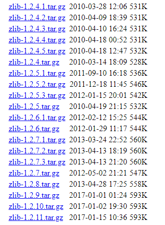

# Linux 环境下 Nginx 安装

这里以 Centos 系列为例安装 Nginx。安装 Nginx 之前需要安装 PCRE 和 zlib。

**为什么需要安装 PCRE?**

nginx的rewrite伪静态匹配规则用到正则，pcre就用来干这个。如果不安装在编译 nginx 时会报如下错误：

```
./configure: error: the HTTP rewrite module requires the PCRE library.

You can either disable the module by using --without-http_rewrite_module

option, or install the PCRE library into the system, or build the PCRE library

statically from the source with nginx by using --with-pcre=<path> option.
```

**为什么需要安装 zlib?**

安装 `zlib` 其实主要是用于用于 `Gzip` 压缩。

# 安装 PCRE

[PCRE]() 安装包可以在官网进行下载。[PCRE 官网传送门](https://sourceforge.net/projects/pcre/)


下载完成后在 `/home/Nginx` 文件夹下上传 `pcre` 安装包并解压：

```bash
$ ll /home/Nginx/pcre-8.42.tar.gz
-rw-r--r--. 1 root root 2081413 Feb 26 15:43 pcre-8.42.tar.gz

$ tar -xzvf pcre-8.42.tar.gz

....

$ mv pcre-8.42 pcre

$ cd pcre
```

进入文件夹后进行执行 `configure` 文件进行编译：

```bash
$ ./configure

checking for a BSD-compatible install... /usr/bin/install -c
checking whether build environment is sane... yes
checking for a thread-safe mkdir -p... /usr/bin/mkdir -p
checking for gawk... gawk
checking whether make sets $(MAKE)... yes
checking whether make supports nested variables... yes
checking whether make supports nested variables... (cached) yes
checking for style of include used by make... GNU
checking for gcc... gcc
checking whether the C compiler works... yes
checking for C compiler default output file name... a.out
checking for suffix of executables... 
checking whether we are cross compiling... no
checking for suffix of object files... o
checking whether we are using the GNU C compiler... yes
checking whether gcc accepts -g... yes
checking for gcc option to accept ISO C89... none needed
checking whether gcc understands -c and -o together... yes
checking dependency style of gcc... gcc3
checking for ar... ar
...
```

完成后执行 `make` 命令：

```bash
$ make

rm -f pcre_chartables.c
ln -s ./pcre_chartables.c.dist pcre_chartables.c
make  all-am
make[1]: Entering directory `/home/Nginx/pcre'
  CC       libpcre_la-pcre_byte_order.lo
  CC       libpcre_la-pcre_compile.lo
  CC       libpcre_la-pcre_config.lo
...
```

执行完毕后继续执行 `make install` 命令：

```bash
$ make install

make  install-am
make[1]: Entering directory `/home/Nginx/pcre'
make[2]: Entering directory `/home/Nginx/pcre'
 /usr/bin/mkdir -p '/usr/local/lib'
 /bin/sh ./libtool   --mode=install /usr/bin/install -c   libpcre.la libpcreposix.la libpcrecpp.la '/usr/local/lib'
libtool: install: /usr/bin/install -c .libs/libpcre.so.1.2.10 /usr/local/lib/libpcre.so.1.2.10

...

make[3]: Leaving directory `/home/Nginx/pcre'
make[2]: Leaving directory `/home/Nginx/pcre'
make[1]: Leaving directory `/home/Nginx/pcre'
```

到此，pcre 安装完成！

# 安装 zlib

[zlib]() 安装包同样可以在官网进行下载。[zlib 官网传送门](http://www.zlib.net/)


`zlib` 可以通过 `wget` 指令进行下载，这里以 `zlib-1.2.11` 为例：

```bash
$ wget http://www.zlib.net/zlib-1.2.11.tar.gz

--2019-02-26 15:51:59--  http://www.zlib.net/zlib-1.2.11.tar.gz
Resolving www.zlib.net (www.zlib.net)... 68.66.224.164
Connecting to www.zlib.net (www.zlib.net)|68.66.224.164|:80... connected.
HTTP request sent, awaiting response... 200 OK
Length: 607698 (593K) [application/x-gzip]
Saving to: ‘zlib-1.2.11.tar.gz’

100%[===================================================================================================================================================>] 607,698      392KB/s   in 1.5s   

2019-02-26 15:52:01 (392 KB/s) - zlib-1.2.11.tar.gz saved [607698/607698]
```

另外，你也可以直接在历史归档中进行下载，[zlib 归档链接](http://www.zlib.net/fossils/)



下载完成后解压即可：

```bash
[root@localhost Nginx]# ll
drwxr-xr-x.  9 1169  1169   12288 Feb 26 15:45 pcre
-rw-r--r--.  1 root root  2081413 Feb 26 15:43 pcre-8.42.tar.gz
drwxr-xr-x. 14  501 games    4096 Feb 26 15:54 zlib
-rw-r--r--.  1 root root   607698 Jan 16  2017 zlib-1.2.11.tar.gz
```

进入 `zlib` 文件夹，依次执行 `make` `make install` 命令进行编译、安装：

```bash
$ cd zlib
$ ./configure 

Checking for gcc...
Checking for shared library support...
Building shared library libz.so.1.2.11 with gcc.
Checking for size_t... Yes.
Checking for off64_t... Yes.
Checking for fseeko... Yes.
Checking for strerror... Yes.
Checking for unistd.h... Yes.
Checking for stdarg.h... Yes.
Checking whether to use vs[n]printf() or s[n]printf()... using vs[n]printf().
Checking for vsnprintf() in stdio.h... Yes.
Checking for return value of vsnprintf()... Yes.
Checking for attribute(visibility) support... Yes.

$ make

gcc -O3 -D_LARGEFILE64_SOURCE=1 -DHAVE_HIDDEN -I. -c -o example.o test/example.c
gcc -O3 -D_LARGEFILE64_SOURCE=1 -DHAVE_HIDDEN  -c -o adler32.o adler32.c
gcc -O3 -D_LARGEFILE64_SOURCE=1 -DHAVE_HIDDEN  -c -o crc32.o crc32.c
gcc -O3 -D_LARGEFILE64_SOURCE=1 -DHAVE_HIDDEN  -c -o deflate.o deflate.c
gcc -O3 -D_LARGEFILE64_SOURCE=1 -DHAVE_HIDDEN  -c -o infback.o infback.c
gcc -O3 -D_LARGEFILE64_SOURCE=1 -DHAVE_HIDDEN  -c -o inffast.o inffast.c
gcc -O3 -D_LARGEFILE64_SOURCE=1 -DHAVE_HIDDEN  -c -o inflate.o inflate.c
gcc -O3 -D_LARGEFILE64_SOURCE=1 -DHAVE_HIDDEN  -c -o inftrees.o inftrees.c
gcc -O3 -D_LARGEFILE64_SOURCE=1 -DHAVE_HIDDEN  -c -o trees.o trees.c
gcc -O3 -D_LARGEFILE64_SOURCE=1 -DHAVE_HIDDEN  -c -o zutil.o zutil.c
...

$ make install

rm -f /usr/local/lib/libz.a
cp libz.a /usr/local/lib
chmod 644 /usr/local/lib/libz.a
cp libz.so.1.2.11 /usr/local/lib
chmod 755 /usr/local/lib/libz.so.1.2.11
rm -f /usr/local/share/man/man3/zlib.3
cp zlib.3 /usr/local/share/man/man3
chmod 644 /usr/local/share/man/man3/zlib.3
rm -f /usr/local/lib/pkgconfig/zlib.pc
cp zlib.pc /usr/local/lib/pkgconfig
chmod 644 /usr/local/lib/pkgconfig/zlib.pc
rm -f /usr/local/include/zlib.h /usr/local/include/zconf.h
cp zlib.h zconf.h /usr/local/include
chmod 644 /usr/local/include/zlib.h /usr/local/include/zconf.h
```

这样 `pcre` 和 `zlib` 安装编译完成。

需要注意，如果在编译过程中提示无权限，则需要执行如下命令进行获取全部权限：

```bash
// <dir> 是文件夹
$ chmod -R 777 <dir> 
```

# 安装 Nginx

在官网下载 [Nginx]() 安装包，[Nginx 官网传送门](https://nginx.org/)

将安装包上传至 `/home/Nginx` 文件夹进行解压、并进入 nginx 文件夹：

```bash
$ pwd
/home/Nginx

$ ll
total 3644
drwxr-xr-x. 10 1001  1001     198 Feb 26 16:02 nginx
-rw-r--r--.  1 root root  1015384 Feb 26 15:22 nginx-1.14.2.tar.gz
drwxr-xr-x.  9 1169  1169   12288 Feb 26 15:45 pcre
-rw-r--r--.  1 root root  2081413 Feb 26 15:43 pcre-8.42.tar.gz
drwxr-xr-x. 14  501 games    4096 Feb 26 15:54 zlib
-rw-r--r--.  1 root root   607698 Jan 16  2017 zlib-1.2.11.tar.gz

$ cd nginx
```

在文件夹中你可以看到如下文件：

```bash
$ ll

total 732
drwxr-xr-x. 6 1001 1001   4096 Feb 26 17:12 auto
-rw-r--r--. 1 1001 1001 288742 Dec  4 22:52 CHANGES
-rw-r--r--. 1 1001 1001 440121 Dec  4 22:52 CHANGES.ru
drwxr-xr-x. 2 1001 1001    168 Feb 26 17:12 conf
-rwxr-xr-x. 1 1001 1001   2502 Dec  4 22:52 configure
drwxr-xr-x. 4 1001 1001     72 Feb 26 17:12 contrib
drwxr-xr-x. 2 1001 1001     40 Feb 26 17:12 html
-rw-r--r--. 1 1001 1001   1397 Dec  4 22:52 LICENSE
drwxr-xr-x. 2 1001 1001     21 Feb 26 17:12 man
-rw-r--r--. 1 1001 1001     49 Dec  4 22:52 README
drwxr-xr-x. 9 1001 1001     91 Feb 26 17:12 src
```

看到，有一个 `configure` 文件，需要进行编译后才会产生 `nginx` 文件。

下面进行编译和安装：

```bash
./configure --prefix=/home/Nginx/nginx
```

**说明：** `--prefix` 指定编译后文件产生路径，如果不指定则默认则解压后存储在 `/usr/local/nginx` 中，因此需要指定一下。

执行 `make` 命令：

```bash
$ make

make -f objs/Makefile
make[1]: Entering directory `/home/Nginx/nginx'
cc -c -pipe  -O -W -Wall -Wpointer-arith -Wno-unused-parameter -Werror -g  -I src/core -I src/event -I src/event/modules -I src/os/unix -I objs \
        -o objs/src/core/nginx.o \
        src/core/nginx.c
cc -c -pipe  -O -W -Wall -Wpointer-arith -Wno-unused-parameter -Werror -g  -I src/core -I src/event -I src/event/modules -I src/os/unix -I objs \
...
```

执行 `make install` 命令：

```bash
$ make install

make -f objs/Makefile install
make[1]: Entering directory `/home/Nginx/nginx'
test -d '/home/Nginx/nginx' || mkdir -p '/home/Nginx/nginx'
...
```

到此即编译完成，看下文件夹是是否有 `sbin` 文件夹：

```bash
$ ll

total 736
drwxr-xr-x. 6 1001 1001   4096 Feb 26 15:32 auto
-rw-r--r--. 1 1001 1001 288742 Dec  4 22:52 CHANGES
-rw-r--r--. 1 1001 1001 440121 Dec  4 22:52 CHANGES.ru
drwxr-xr-x. 2 1001 1001    168 Feb 26 15:32 conf
-rwxr-xr-x. 1 1001 1001   2502 Dec  4 22:52 configure
drwxr-xr-x. 4 1001 1001     72 Feb 26 15:32 contrib
drwxr-xr-x. 2 1001 1001     40 Feb 26 15:32 html
-rw-r--r--. 1 1001 1001   1397 Dec  4 22:52 LICENSE
-rw-r--r--. 1 root root    380 Feb 26 16:02 Makefile
drwxr-xr-x. 2 1001 1001     21 Feb 26 15:32 man
drwxr-xr-x. 3 root root    174 Feb 26 16:02 objs
-rw-r--r--. 1 1001 1001     49 Dec  4 22:52 README
drwxr-xr-x. 2 root root     19 Feb 26 16:02 sbin   // 已经有了该文件夹
drwxr-xr-x. 9 1001 1001     91 Feb 26 15:32 src

$ cd sbin/
$ ll

total 3660
-rwxr-xr-x. 1 root root 3747360 Feb 26 16:02 nginx  // nginx 编译完成
```