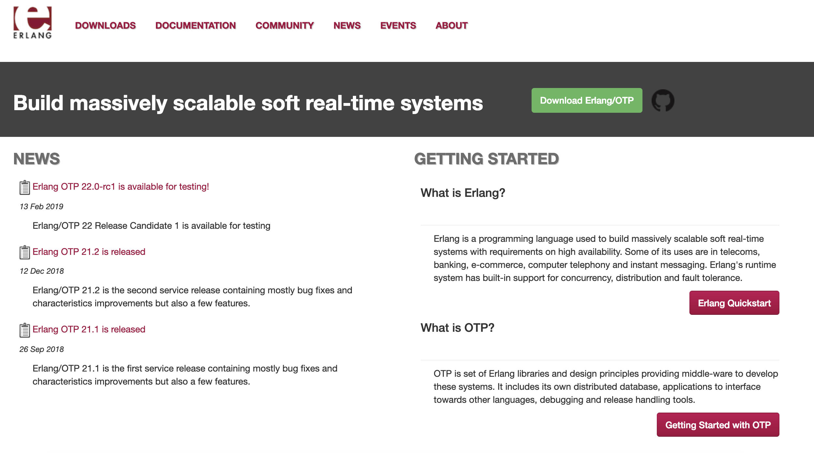
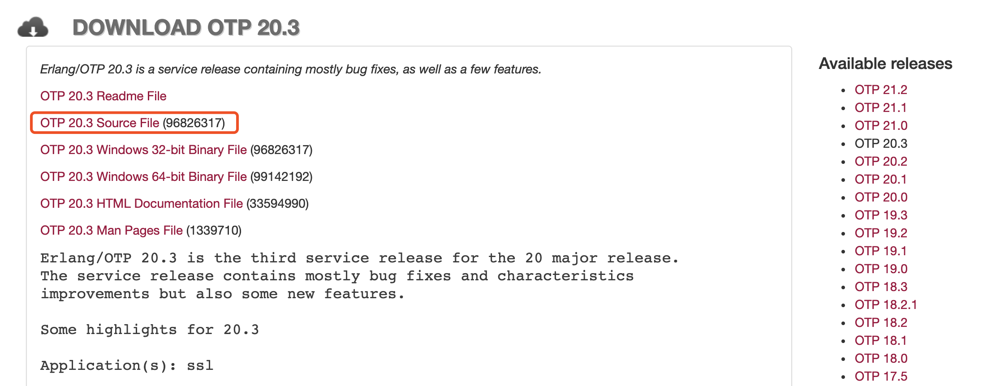
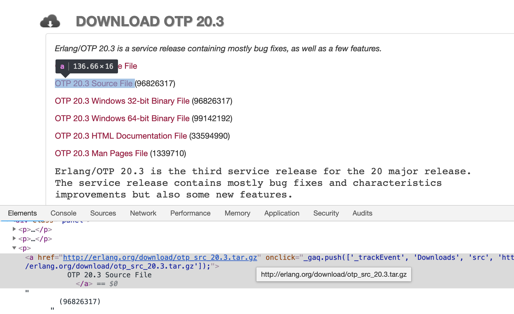

# 前言

`Erlang` 安装文件可以到 [官网](http://www.erlang.org/) 进行下载，如下图：



点击 `DOWNLOADS` 进入版本选择页面，笔者使用的是 `v20.3` 版本，因此这里下载该版本，点击 `Source File` 进行下载。



笔者因为不想先下载后再上传到机器，因此直接使用 `wget` 进行下载，如果你没有安装 `wget` 你可以执行如下命令进行下载：

```
$ yum install -y wget
已加载插件：fastestmirror
Loading mirror speeds from cached hostfile
 * base: mirrors.163.com
 * extras: mirrors.huaweicloud.com
 * updates: mirrors.aliyun.com
base                                                                           | 3.6 kB  00:00:00     
extras                                                                         | 3.4 kB  00:00:00     
updates                                                                        | 3.4 kB  00:00:00     
正在解决依赖关系
--> 正在检查事务
---> 软件包 wget.x86_64.0.1.14-18.el7 将被 安装
--> 解决依赖关系完成

依赖关系解决

======================================================================================================
 Package              架构                   版本                          源                    大小
======================================================================================================
正在安装:
 wget                 x86_64                 1.14-18.el7                   base                 547 k

.....
```

`wget` 下载完成后你可以输入 `wget` 进行测试，如下：

```
$ wget
wget：未指定 URL
用法： wget [选项]... [URL]...

请尝试使用“wget --help”查看更多的选项。
```

现在就来下载 `erlang`，示例：

```
$ wget http://erlang.org/download/otp_src_20.3.tar.gz
```

如果你不知道 URL 你可以使用页面查看工具，选中 `OTP 20.3 Source File (96337114)` 元素查看链接即可，如下：



笔者将文件下载到 `/home/tools` 路径下：

```
$ pwd
/home/tools

$ wget http://erlang.org/download/otp_src_20.3.tar.gz
--2019-03-03 15:16:49--  http://erlang.org/download/otp_src_20.3.tar.gz
正在解析主机 erlang.org (erlang.org)... 192.121.151.106
正在连接 erlang.org (erlang.org)|192.121.151.106|:80... 已连接。
已发出 HTTP 请求，正在等待回应... 200 OK
长度：87346046 (83M) [application/x-tar]
正在保存至: “otp_src_20.0.tar.gz”

100%[============================================================>] 87,346,046   278KB/s 用时 5m 18s 

2019-03-03 15:22:09 (268 KB/s) - 已保存 “otp_src_20.3.tar.gz” [87346046/87346046])
```

下载完成后可以看到多了一个 `otp_src_20.3.tar.gz` 包文件：

```
$ ls
otp_src_20.3.tar.gz
```

# 安装

将下载后的包文件进行解压：

```
# 解压
$ tar -xvf otp_src_20.3.tar.gz

# 查看文件
$ ls
otp_src_20.3  otp_src_20.3.tar.gz
```

现在，进入解压后的文件目录查看其中的文件

```
$ cd otp_src_20.3

# 查看文件
$ ls
  aclocal.m4  bootstrap     CONTRIBUTING.md         HOWTO        make         otp_patch_apply     plt                    README.md  TAR.include
  AUTHORS     configure     erl-build-tool-vars.sh  lib          Makefile.in  OTP_VERSION         prebuilt.files         scripts    xcomp
  bin         configure.in  erts                    LICENSE.txt  otp_build    otp_versions.table  proposed_updates.json  system
```

文件列表中有一个 `configure` 文件，该文件就是我们需要编译的，你可以在该目录下执行 `./configure --help` 查看相关参数信息。

现在就来编译，在当前目录执行如下命令：

```
./configure --prefix=/usr/local/erlang
```

- `--prefix` 选项就是制定编译的文件存储目录，笔者习惯于将软件都按照在 `/usr/local` 目录下，你也可以指定你想要的目录，不过这是一种规范。

现在就来执行编译命令：

````
$ ./configure --prefix=/usr/local/erlang 

Ignoring the --cache-file argument since it can cause the system to be erroneously configured
Disabling caching
checking build system type... x86_64-unknown-linux-gnu
checking host system type... x86_64-unknown-linux-gnu
checking for gcc... no
checking for cc... no
checking for cc... no
checking for cl... no
configure: error: no acceptable C compiler found in $PATH
See `config.log' for more details.
````

如果你输出如上信息，说明你本机没有 `GCC` 软件套，你可以执行如下命令进行安装：

```
$ yum install -y gcc
```

安装完成后再次执行编译命令：

```
$ ./configure --prefix=/usr/local/erlang 
```

如果你以为再次执行编译命令就会成功，那你就 oo young,too simple 了（除非你之前已经安装过）！

来来来，仔细看最后几行输出日志：


```
....
checking for tgetent in -ltinfo... no
checking for tgetent in -lncurses... no
checking for tgetent in -lcurses... no
checking for tgetent in -ltermcap... no
checking for tgetent in -ltermlib... no
configure: error: No curses library functions found
configure: error: /bin/sh '/home/tools/otp_src_20.0/erts/configure' failed for erts
```

看到 `configure: error: No curses library functions found` 信息没有？这是提示你本机没有需要 `ncurses` 依赖，你可以使用 `yum search ncurses`
查看信息：

```
$ yum search ncurses

已加载插件：fastestmirror
Loading mirror speeds from cached hostfile
 * base: mirrors.163.com
 * extras: mirrors.huaweicloud.com
 * updates: mirrors.aliyun.com
==================================================================== N/S matched: ncurses ====================================================================
ncurses.x86_64 : Ncurses support utilities
ncurses-devel.i686 : Development files for the ncurses library
ncurses-devel.x86_64 : Development files for the ncurses library
ncurses-libs.i686 : Ncurses libraries
ncurses-libs.x86_64 : Ncurses libraries
ncurses-static.i686 : Static libraries for the ncurses library
ncurses-static.x86_64 : Static libraries for the ncurses library
ncurses-base.noarch : Descriptions of common terminals
ncurses-term.noarch : Terminal descriptions
ocaml-curses.x86_64 : OCaml bindings for ncurses

  名称和简介匹配 only，使用“search all”试试。
```

其中 `ncurses-devel` 就是你需要安装的！

```
$ yum install -y ncurses-devel

...

已安装:
  ncurses-devel.x86_64 0:5.9-14.20130511.el7_4 

完毕！  
```

安装好之后再次运行编译命令：

```
$ ./configure --prefix=/usr/local/erlang 
```

然后你等啊等，等到最后可能输出如下信息：

```
......
*********************************************************************
**********************  APPLICATIONS DISABLED  **********************
*********************************************************************

crypto         : No usable OpenSSL found
jinterface     : Java compiler disabled by user
odbc           : ODBC library - link check failed
orber          : No C++ compiler found
ssh            : No usable OpenSSL found
ssl            : No usable OpenSSL found

*********************************************************************
*********************************************************************
**********************  APPLICATIONS INFORMATION  *******************
*********************************************************************

wx             : wxWidgets not found, wx will NOT be usable

*********************************************************************
*********************************************************************
**********************  DOCUMENTATION INFORMATION  ******************
*********************************************************************

documentation  : 
                 fop is missing.
                 Using fakefop to generate placeholder PDF files.

*********************************************************************
```

惊不惊喜？意不意外？

> **[info] 小提示**
>
> 你暂时只需要看 **APPLICATIONS DISABLED** 中的信息即可，后面再作说明！

啥也不说，你需要安装 `OpenSSL`，先使用 `yum list | grep ssl` 查看一下具体信息：

```
$ yum list | grep ssl

  openssl.x86_64                             1:1.0.2k-16.el7             @base    
  openssl-libs.x86_64                        1:1.0.2k-16.el7             @base    
  xmlsec1-openssl.x86_64                     1.2.20-7.el7_4              @anaconda
  apr-util-openssl.x86_64                    1.5.2-6.el7                 base     
  docbook-style-dsssl.noarch                 1.79-18.el7                 base     
  mod_ssl.x86_64                             1:2.4.6-88.el7.centos       base     
  nss_compat_ossl.i686                       0.9.6-8.el7                 base     
  nss_compat_ossl.x86_64                     0.9.6-8.el7                 base     
  nss_compat_ossl-devel.i686                 0.9.6-8.el7                 base     
  nss_compat_ossl-devel.x86_64               0.9.6-8.el7                 base     
  openssl-devel.i686                         1:1.0.2k-16.el7             base     
  openssl-devel.x86_64                       1:1.0.2k-16.el7             base     
  openssl-libs.i686                          1:1.0.2k-16.el7             base     
  openssl-perl.x86_64                        1:1.0.2k-16.el7             base     
  openssl-static.i686                        1:1.0.2k-16.el7             base     
  openssl-static.x86_64                      1:1.0.2k-16.el7             base     
  openssl098e.i686                           0.9.8e-29.el7.centos.3      base     
  openssl098e.x86_64                         0.9.8e-29.el7.centos.3      base     
  python-backports-ssl_match_hostname.noarch 3.5.0.1-1.el7               base     
  python-passlib.noarch                      1.6.5-2.el7                 extras   
  qca-ossl.i686                              2.0.0-0.19.beta3.el7        base     
  qca-ossl.x86_64                            2.0.0-0.19.beta3.el7        base     
  xmlsec1-openssl.i686                       1.2.20-7.el7_4              base     
  xmlsec1-openssl-devel.i686                 1.2.20-7.el7_4              base     
  xmlsec1-openssl-devel.x86_64               1.2.20-7.el7_4              base     
```

`openssl-devel` 这个是你需要安装的，执行安装命令：

```
$ yum install -y openssl-devel
```

安装完毕后重新执行编译命令：

```
$ ./configure --prefix=/usr/local/erlang 
```

然后你可能得到如下信息：

```
......
*********************************************************************
**********************  APPLICATIONS DISABLED  **********************
*********************************************************************

jinterface     : Java compiler disabled by user
odbc           : ODBC library - link check failed
orber          : No C++ compiler found

*********************************************************************
*********************************************************************
......
```

原因是缺少 `ODBC` 依赖，使用 `yum list` 指令进行查看信息：

```
$ yum list | grep ODBC

freeradius-unixODBC.x86_64                 3.0.13-9.el7_5              base     
qt3-ODBC.i686                              3.3.8b-51.el7               base     
qt3-ODBC.x86_64                            3.3.8b-51.el7               base     
unixODBC.i686                              2.3.1-11.el7                base     
unixODBC.x86_64                            2.3.1-11.el7                base     
unixODBC-devel.i686                        2.3.1-11.el7                base     
unixODBC-devel.x86_64                      2.3.1-11.el7                base   
```

需要安装 `unixODBC-devel`，进行安装：

```
$ yum install -y unixODBC-devel
```

安装完毕再次执行编译命令：

```
$ ./configure --prefix=/usr/local/erlang 
```

然后你还可能得到如下信息：

```
......
*********************************************************************
**********************  APPLICATIONS DISABLED  **********************
*********************************************************************

jinterface     : Java compiler disabled by user
orber          : No C++ compiler found

*********************************************************************
*********************************************************************
......
```

缺少 `gcc-c++` 编译环境，进行安装：

```
$ yum install -y gcc-c++
```

安装后重新执行编译命令：

```
$ ./configure --prefix=/usr/local/erlang 
```

不出意外，最后只剩下一个 `jinterface     : Java compiler disabled by user` 错误信息，这是因为你本地没有 `javac` 编译环境，当然你也可以
增加 `--without-javac` 选项进行说明不使用 `javac`。不过，很意外，笔者在另一台机器上使用该选项是起作用的，不过这台机器 ....

所以，还是安装 `jvm` 环境吧，具体安装可以见 [Linux 下 JVM 环境安装](./JDK-install.md)，这里不作说明，安装成功后输入 `javac` 你会得到如
下输出信息：

```
javac
用法: javac <options> <source files>
其中, 可能的选项包括:
  -g                         生成所有调试信息
  -g:none                    不生成任何调试信息
  -g:{lines,vars,source}     只生成某些调试信息
  -nowarn                    不生成任何警告
  -verbose                   输出有关编译器正在执行的操作的消息
  -deprecation               输出使用已过时的 API 的源位置
  -classpath <路径>            指定查找用户类文件和注释处理程序的位置
  -cp <路径>                   指定查找用户类文件和注释处理程序的位置
  -sourcepath <路径>           指定查找输入源文件的位置
  -bootclasspath <路径>        覆盖引导类文件的位置
  -extdirs <目录>              覆盖所安装扩展的位置
  -endorseddirs <目录>         覆盖签名的标准路径的位置
  -proc:{none,only}          控制是否执行注释处理和/或编译。
  -processor <class1>[,<class2>,<class3>...] 要运行的注释处理程序的名称; 绕过默认的搜索进程
  -processorpath <路径>        指定查找注释处理程序的位置
  -parameters                生成元数据以用于方法参数的反射
  -d <目录>                    指定放置生成的类文件的位置
  -s <目录>                    指定放置生成的源文件的位置
  -h <目录>                    指定放置生成的本机标头文件的位置
  -implicit:{none,class}     指定是否为隐式引用文件生成类文件
  -encoding <编码>             指定源文件使用的字符编码
  -source <发行版>              提供与指定发行版的源兼容性
  -target <发行版>              生成特定 VM 版本的类文件
  -profile <配置文件>            请确保使用的 API 在指定的配置文件中可用
  -version                   版本信息
  -help                      输出标准选项的提要
  -A关键字[=值]                  传递给注释处理程序的选项
  -X                         输出非标准选项的提要
  -J<标记>                     直接将 <标记> 传递给运行时系统
  -Werror                    出现警告时终止编译
  @<文件名>                     从文件读取选项和文件名
```

再次执行编译命令：

```
$ ./configure --prefix=/usr/local/erlang 
```

最后的最后，只会输出如下信息的：

```
......
*********************************************************************
**********************  APPLICATIONS INFORMATION  *******************
*********************************************************************

wx             : wxWidgets not found, wx will NOT be usable

*********************************************************************
*********************************************************************
**********************  DOCUMENTATION INFORMATION  ******************
*********************************************************************

documentation  : 
                 fop is missing.
                 Using fakefop to generate placeholder PDF files.

*********************************************************************
```

这些信息可以不用理的，并不会影响环境问题。不过，`APPLICATIONS INFORMATION` 中的信息你可以 **选择** 进行安装的，不安装也并不会影响使用。笔者
就不介绍具体步骤了，因为笔者之前安装过一次，然后想死的心都有了。所以，如果你为了调试方便可以考虑安装。你可以到 [wxWidgets 官网](https://www.wxwidgets.org) 进行下载：


选择相应的系统版本，同样是解压后进入目录执行 `./configure --prefix=/usr/local/wxWidgets` 命令，命令执行完毕后接着执行如下两个命令即可：

```
$ make
$ make install
``` 

现在继续之前的步骤。到此基本上是已经完成了，继续在当前目录执行编译安装命令即可：

```
$ make
```

这个需要等待一段时间 ...... (等啊等)，完成后执行如下命令编译安装就大功告成了！

```
$ make install
```

# 配置环境变量

编译安装完成后可以进入指定的 `prefix` 中查看文件信息：

```
$ cd /usr/local/erlang/
$ ls
bin  lib
```

下面就这两个目录，现在进入配置环境变量：

```
$ vim /etc/profile
```

在配置文件中增加如下信息：

```
......
# Erlang Env
export ERLANG_HOME=/usr/local/erlang

export PATH=$PATH:$ERLANG_HOME/bin
```

使配置生效：

```
$ source /etc/profile
```

输入 `erl` 指令如果输出如下信息表示成功！

```
$ erl
Erlang/OTP 20 [erts-9.0] [source] [64-bit] [smp:2:2] [ds:2:2:10] [async-threads:10] [kernel-poll:false]

Eshell V9.0  (abort with ^G)
1> 
```

到此，`Erlang` 环境就配置完成了，回头看还算简单，就是中途需要安装各种软件！

下面就继续 [安装 RabbitMQ](./rabbitmq-install.md)