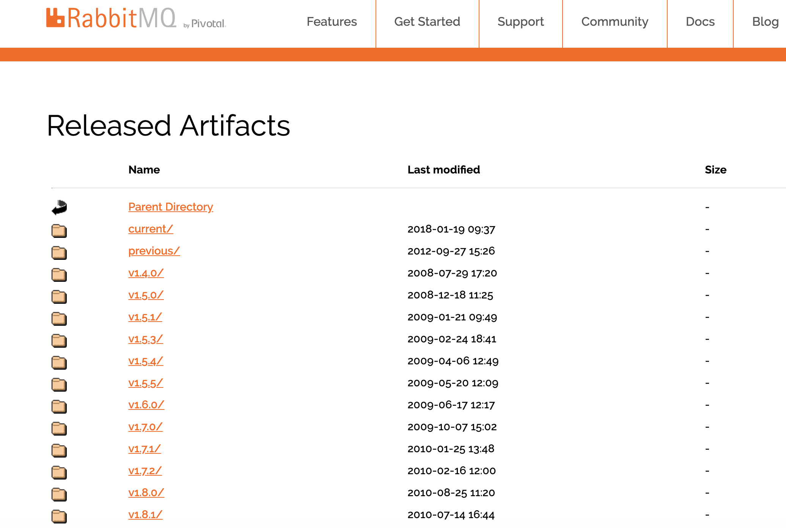
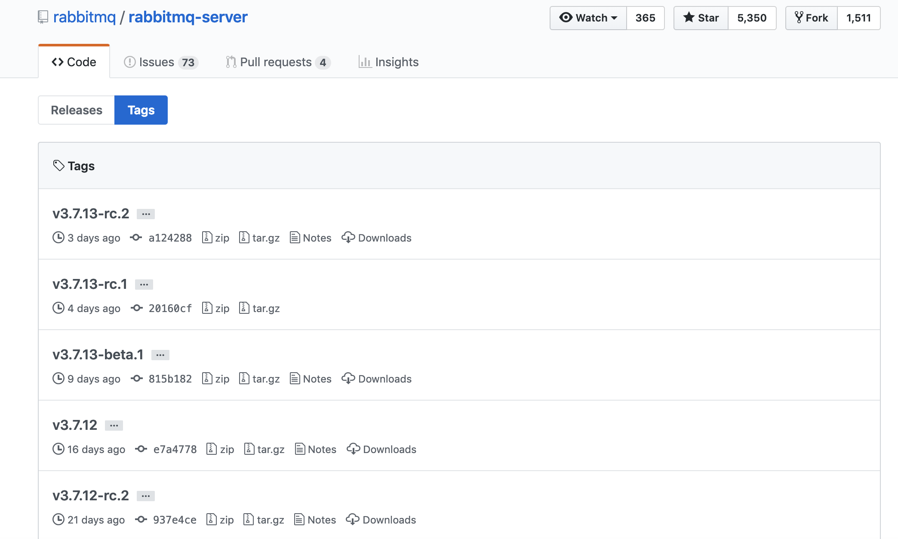
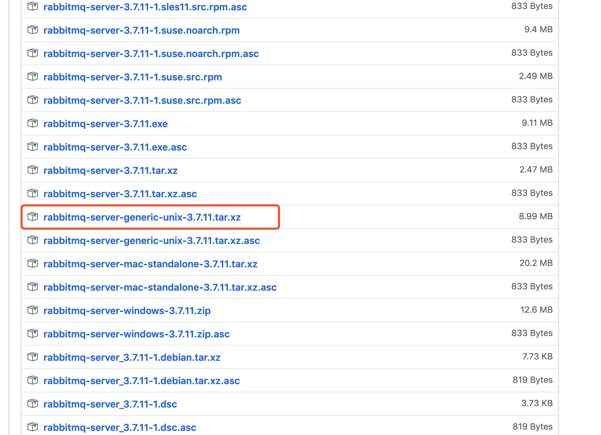
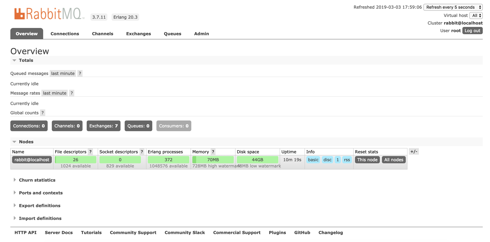

# 前言

由于配置了 `Erlang` 环境，RabbitMQ 安装起来就简单多了。

进入 [RabbitMQ 官网](https://www.rabbitmq.com/) 进入 [下载页面](https://www.rabbitmq.com/download.html)。

不过建议你直接进入 [归档页面](https://www.rabbitmq.com/releases/rabbitmq-server/) 进行下载：



此外，你还可以进行 [RabbitMQ Github](https://github.com/rabbitmq/rabbitmq-server) 中进行下载：



# 下载安装

笔者直接在 Github 上进行下载，选择 `v3.7.11` 版本： `rabbitmq-server-generic-unix-3.7.11.tar.xz`



下载目录为 `/home/mq` :

```
$ pwd
/home/mq

$ wget https://github.com/rabbitmq/rabbitmq-server/releases/download/v3.7.11/rabbitmq-server-generic-unix-3.7.11.tar.xz
```

下载完成后会看到一个以 `.tar.xz` 结尾的包文件：

```
$ ls
rabbitmq-server-generic-unix-3.7.11.tar.xz
```

Mq安装包默认是 `xz` 结尾的，所以需要解压 `xz` 文件后得到 `tar` 文件：

```
$ xz -d rabbitmq-server-generic-unix-3.7.11.tar.xz

$ ls
rabbitmq-server-generic-unix-3.7.11.tar
```

解压 `.tar`：

```
$ tar -xvf rabbitmq-server-generic-unix-3.7.11.tar
ls ls
rabbitmq_server-3.7.11  rabbitmq-server-generic-unix-3.7.11.tar
```

笔者习惯性的将软件包安装在 `/usr/local` 目录下，你也可以将包放置在你喜欢的目录：

```
$ cp rabbitmq_server-3.7.11 /usr/local/rabbitmq -r
```

`-r` 选择是由于 `rabbitmq_server-3.7.11` 文件夹存在多级目录，该选项是进行迭代遍历文件夹。

到此，基本上完成了，进入 `/usr/local/rabbitmq` 看下其中的文件：

```
$ cd /usr/local/rabbitmq/
$ ls

ebin     LICENSE                         LICENSE-BSD-base64js  LICENSE-MIT-EJS              LICENSE-MIT-jQuery164  LICENSE-MPL-RabbitMQ  share
escript  LICENSE-APACHE2                 LICENSE-BSD-recon     LICENSE-MIT-EJS10            LICENSE-MIT-Mochi      LICENSE-rabbitmq_aws
etc      LICENSE-APACHE2-excanvas        LICENSE-erlcloud      LICENSE-MIT-Erlware-Commons  LICENSE-MIT-Sammy      plugins
include  LICENSE-APACHE2-ExplorerCanvas  LICENSE-httpc_aws     LICENSE-MIT-Flot             LICENSE-MIT-Sammy060   priv
INSTALL  LICENSE-APL2-Stomp-Websocket    LICENSE-ISC-cowboy    LICENSE-MIT-jQuery           LICENSE-MPL2           sbin
```

# 环境变量配置

当然，配置不配置环境变量没什么必要，你也可以选择直接在 `./sbin` 目录下运行服务。这里就说下配置环境变量：

```
$ vim /etc/profile
```

内容如下：

```
# RabbitMQ Env
export RABBITMQ_HOME=/usr/local/rabbitmq

export PATH=$PATH:$RABBITMQ_HOME/sbin
```

使配置生效：

```
$ source /etc/profile
```

# 服务启动与插件安装

现在进入 `/usr/local/rabbitmq/sbin` 目录进行运行和配置插件，如果你已经配置环境变量直接执行命令即可！

先看下 `sbin` 目录下的文件：

```
$ ls
cuttlefish  rabbitmqctl  rabbitmq-defaults  rabbitmq-diagnostics  rabbitmq-env  rabbitmq-plugins  rabbitmq-server
```

一目了然，不做说明！

- 安装 `management` 插件

进入 `sbin` 目录运行如下命令查看可用插件：

```
$ ./rabbitmq-plugins list
```

笔者这里启用 `management` 插件来启用 `WEB` 管理插件，你也可以启用响应插件。

```
$ ./rabbitmq-plugins enable rabbitmq_management

  Enabling plugins on node rabbit@localhost:
  rabbitmq_management
  The following plugins have been configured:
    rabbitmq_management
    rabbitmq_management_agent
    rabbitmq_web_dispatch
  Applying plugin configuration to rabbit@localhost...
  The following plugins have been enabled:
    rabbitmq_management
    rabbitmq_management_agent
    rabbitmq_web_dispatch
  
  set 3 plugins.
  Offline change; changes will take effect at broker restart.
```

输出如上信息表示插件启动成功，如果报如下错误则不必在意，可忽略：

```
Applying plugin configuration to rabbit@SZB-L0032605... failed
```

如果报如下错误则是 `openssl` 和 `erlang` 版本不兼容，可以考虑换成 `CentOS7` 或修改版本。

```
rabbitmq Error: dependent plugins [crypto,ssl] not found
```

- 启动服务

在 `/sbin` 目录下运行如下任意一个命令即可：

```
# 直接运行
./rabbitmq-server start  

# 以进程守护的方式后台启动(建议)
$ ./rabbitmq-server -detached 
```

- 查看服务状态

```
$ ./rabbitmq-server status
```

- 关闭服务：

```
$ ./rabbitmqctl stop 
```

- 网页管理登录

之前已经启用了 `WEB` 管理插件，因此直接访问 `IP:15672` 即可访问，登录页面如下：


默认的登录用户名和密码都是 `guest`，不过这只能在本机登录。如果别的机器使用该账号登录会提示如下信息：

```
User can only log in via localhost 
```

因此，我们需要创建一个新用户！

- 创建用户

在创建用户之前先看下当前存在的用户列表，同样在 `/sbin` 目录下执行如下命令：

```
$ ./rabbitmqctl list_users

  Listing users ...
  user	tags
  guest	[administrator]
```

现在创建一个新用户 `root` 密码是 `admin123`

```
$ ./rabbitmqctl add_user root admin123
Adding user "root" ...
```

查看用户权限：

```
$ ./rabbitmqctl list_user_permissions root
    Listing permissions for user "root" ...
    
```

看到，用户没有任何权限，现在为其分配超级管理员权限：

```
$ ./rabbitmqctl set_user_tags root administrator 
  Setting tags for user "root" to [administrator] ...

$ ./rabbitmqctl list_users
  Listing users ...
  user	tags
  guest	[administrator]
  root	[administrator]
```

现在就来使用新用户进行登录吧，登录成功界面如下：



到此， RabbitMQ 才是真正的安装成功！